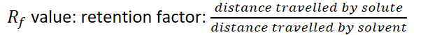
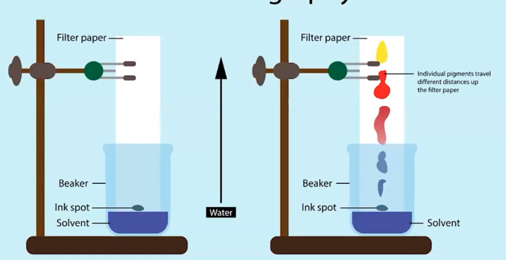
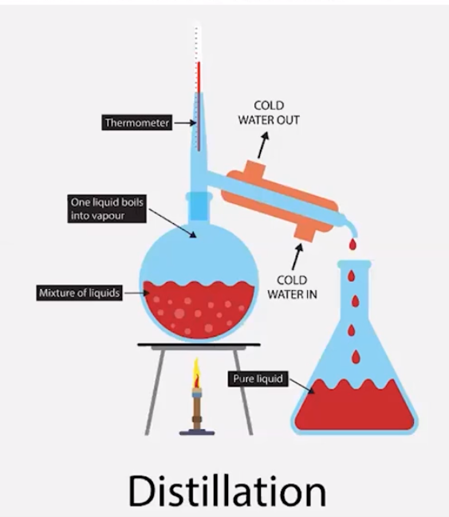

# Separating Mixtures 
-   Components in liquid solutions cannot be filtered by filtration

    -   Filtration only separates based on size

    -   Separating solutions must consider difference between intermolecular interactions of components
-   Chromatography

    -   Separate based on intermolecular attraction

    -   Different intermolecular attractions between/among components of solution (mobile phase) and surface components of paper/column (stationary phase)

    -   Solution ("Mobile Phase") will have different amount of attraction to the paper/column ("Stationary Phase") because of polarity

    -   Solution travels out paper due to capillary action

    -   The more polar a component of the solution

        -   Less interaction it has with the nonpolar stationary phase = travels more

    -   Less polar = more interaction, travels less

    -   {width="6.614583333333333in" height="0.53125in"}

{width="7.114583333333333in" height="3.6458333333333335in"}

-   Distillation

    -   Separates chemical species based on strength of intermolecular attractions

    -   These intermolecular attractions have effects on vapor pressure of components

    -   Separates based on boiling first

        -   Liquid with lower boiling point boils and gets condensed elsewhere

        -   Liquid with higher boiling point remains in container

    -   Vocabulary:

        -   Distillate - liquid that boils off and condenses

        -   Miscible - able to combine and make a solution

{width="3.90625in" height="4.5in"}

