# Types of solids
-   Crystalline Solid - regular arrangements of their components
-   Anamorphous solid - disorderly structures

{width="0.5in" height="4.90625in"}{width="1.9583333333333333in" height="0.3125in"}{width="7.479166666666667in" height="0.3958333333333333in"}{width="1.0833333333333333in" height="0.3229166666666667in"}{width="0.4791666666666667in" height="2.40625in"}{width="0.90625in" height="13.072916666666666in"}{width="0.8020833333333334in" height="13.041666666666666in"}{width="1.9791666666666667in" height="0.3854166666666667in"}{width="0.375in" height="12.770833333333334in"}{width="0.19791666666666666in" height="0.19791666666666666in"}

Molecular Solid
-   Formed by distinct molecules which form molecular lattices
-   Formed exclusively of nonmetal atoms
-   Poor conductors of electricity - electrons held tightly in intramolecular covalent bonds

Ionic solid
-   Made up of a lattice of cations (usually metal) and anions (usually nonmetal)
-   Very strong attractive - high melting/boiling point

Covalent Network Solid
-   Formed by distinct atoms bonded with covalent bonds
-   Bonded in a 3D network
-   Extremely strong and hard - all covalent bonds!
-   Very high melting/boiling point
-   Poor conductors of electricity - electrons held tightly in covalent bonds

Metallic Solid
-   Formed by metallic elements
-   Metallic bonding - valence electrons are free to flow from atom to atom ("sea" of electrons)

{width="1.5729166666666667in" height="1.6041666666666667in"}{width="1.5416666666666667in" height="1.5833333333333333in"}{width="1.5in" height="1.5104166666666667in"}{width="1.5in" height="1.5in"}{width="1.5416666666666667in" height="1.6041666666666667in"}{width="1.5625in" height="1.6041666666666667in"}{width="1.5625in" height="1.5416666666666667in"}{width="1.5104166666666667in" height="1.5104166666666667in"}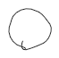{width="0.6875in" height="0.6770833333333334in"}{width="0.59375in" height="0.65625in"}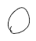{width="0.4791666666666667in" height="0.5416666666666666in"}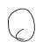{width="0.5104166666666666in" height="0.5833333333333334in"}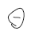{width="0.40625in" height="0.4583333333333333in"}{width="1.5833333333333333in" height="1.59375in"}{width="1.5520833333333333in" height="1.5833333333333333in"}{width="1.5104166666666667in" height="1.5104166666666667in"}{width="0.20833333333333334in" height="0.3958333333333333in"}{width="0.20833333333333334in" height="0.3229166666666667in"}{width="0.3541666666666667in" height="0.25in"}{width="1.5208333333333333in" height="1.53125in"}{width="0.23958333333333334in" height="0.4270833333333333in"}{width="1.5208333333333333in" height="1.4895833333333333in"}{width="0.22916666666666666in" height="0.3541666666666667in"}{width="0.3020833333333333in" height="0.21875in"}{width="0.2916666666666667in" height="0.19791666666666666in"}{width="0.375in" height="0.23958333333333334in"}{width="0.3541666666666667in" height="0.20833333333333334in"}{width="0.6666666666666666in" height="0.22916666666666666in"}{width="0.2604166666666667in" height="0.20833333333333334in"}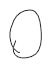{width="0.53125in" height="0.6979166666666666in"}{width="1.6041666666666667in" height="1.6354166666666667in"}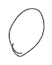{width="0.6145833333333334in" height="0.7708333333333334in"}{width="1.5625in" height="1.5833333333333333in"}{width="1.5104166666666667in" height="1.5in"}{width="0.7395833333333334in" height="0.65625in"}{width="1.5in" height="1.5520833333333333in"}{width="1.625in" height="1.6666666666666667in"}{width="0.22916666666666666in" height="0.3020833333333333in"}{width="1.59375in" height="1.6458333333333333in"}{width="1.625in" height="1.6666666666666667in"}{width="1.6145833333333333in" height="1.6666666666666667in"}{width="0.4583333333333333in" height="0.5416666666666666in"}{width="1.59375in" height="1.6458333333333333in"}{width="1.6145833333333333in" height="1.6666666666666667in"}{width="0.3229166666666667in" height="0.20833333333333334in"}{width="0.34375in" height="0.22916666666666666in"}{width="0.4166666666666667in" height="0.4895833333333333in"}{width="0.28125in" height="0.20833333333333334in"}{width="0.21875in" height="0.3541666666666667in"}{width="0.28125in" height="0.22916666666666666in"}{width="0.375in" height="0.3854166666666667in"}{width="0.23958333333333334in" height="0.3958333333333333in"}{width="0.3229166666666667in" height="0.21875in"}{width="0.2604166666666667in" height="0.19791666666666666in"}{width="0.4166666666666667in" height="0.23958333333333334in"}{width="1.5520833333333333in" height="1.5729166666666667in"}{width="1.59375in" height="1.6041666666666667in"}{width="1.5104166666666667in" height="1.5208333333333333in"}{width="0.21875in" height="0.3645833333333333in"}{width="0.22916666666666666in" height="0.3229166666666667in"}{width="1.5208333333333333in" height="1.5208333333333333in"}{width="0.5520833333333334in" height="0.59375in"}{width="0.3125in" height="0.21875in"}{width="0.28125in" height="0.20833333333333334in"}{width="0.34375in" height="0.22916666666666666in"}{width="0.5520833333333334in" height="0.5833333333333334in"}{width="0.5833333333333334in" height="0.6145833333333334in"}{width="0.2604166666666667in" height="0.21875in"}{width="0.53125in" height="0.5729166666666666in"}{width="0.53125in" height="0.59375in"}{width="0.59375in" height="0.625in"}{width="0.5416666666666666in" height="0.5625in"}{width="0.4270833333333333in" height="0.4791666666666667in"}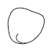{width="0.6770833333333334in" height="0.6770833333333334in"}{width="0.5729166666666666in" height="0.59375in"}{width="0.4166666666666667in" height="0.5520833333333334in"}{width="0.5833333333333334in" height="0.3645833333333333in"}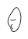{width="0.375in" height="0.5208333333333334in"}{width="0.25in" height="0.375in"}{width="0.21875in" height="0.3541666666666667in"}{width="0.22916666666666666in" height="0.3645833333333333in"}{width="0.3125in" height="0.20833333333333334in"}{width="0.5416666666666666in" height="0.59375in"}{width="0.3229166666666667in" height="0.21875in"}{width="0.53125in" height="0.5625in"}{width="0.3854166666666667in" height="0.22916666666666666in"}{width="0.3541666666666667in" height="0.22916666666666666in"}{width="0.40625in" height="0.6354166666666666in"}{width="0.3229166666666667in" height="0.21875in"}{width="0.21875in" height="0.3020833333333333in"}{width="0.5416666666666666in" height="0.59375in"}{width="0.5416666666666666in" height="0.6145833333333334in"}{width="1.59375in" height="1.6458333333333333in"}{width="1.625in" height="1.6666666666666667in"}{width="1.59375in" height="1.6458333333333333in"}{width="1.59375in" height="1.6458333333333333in"}{width="1.625in" height="1.6666666666666667in"}{width="0.6875in" height="0.8125in"}{width="1.59375in" height="1.6458333333333333in"}{width="0.5520833333333334in" height="0.5729166666666666in"}{width="1.5833333333333333in" height="1.6770833333333333in"}{width="0.7291666666666666in" height="0.375in"}{width="0.2916666666666667in" height="0.5416666666666666in"}{width="0.3645833333333333in" height="0.4375in"}{width="0.25in" height="0.3541666666666667in"}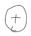{width="0.6354166666666666in" height="0.7395833333333334in"}{width="0.5729166666666666in" height="0.5729166666666666in"}{width="0.25in" height="0.3854166666666667in"}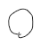{width="0.4791666666666667in" height="0.53125in"}{width="0.3020833333333333in" height="0.375in"}{width="0.53125in" height="0.6145833333333334in"}{width="0.3229166666666667in" height="0.6145833333333334in"}{width="0.3333333333333333in" height="0.3854166666666667in"}{width="0.4791666666666667in" height="0.3020833333333333in"}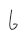{width="0.2708333333333333in" height="0.3958333333333333in"}{width="0.46875in" height="0.5520833333333334in"}{width="0.3020833333333333in" height="0.20833333333333334in"}{width="0.3125in" height="0.22916666666666666in"}{width="0.22916666666666666in" height="0.3541666666666667in"}{width="0.34375in" height="0.23958333333333334in"}{width="0.2708333333333333in" height="0.21875in"}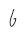{width="0.2604166666666667in" height="0.375in"}{width="0.28125in" height="0.3333333333333333in"}{width="0.2916666666666667in" height="0.2916666666666667in"}{width="0.28125in" height="0.3020833333333333in"}{width="0.5625in" height="0.5625in"}{width="0.21875in" height="0.40625in"}{width="0.3020833333333333in" height="0.2916666666666667in"}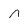{width="0.2916666666666667in" height="0.28125in"}{width="0.2916666666666667in" height="0.4166666666666667in"}{width="0.23958333333333334in" height="0.3541666666666667in"}{width="0.3229166666666667in" height="0.21875in"}{width="0.22916666666666666in" height="0.34375in"}{width="1.6770833333333333in" height="1.71875in"}{width="0.5729166666666666in" height="0.59375in"}{width="0.2916666666666667in" height="0.3020833333333333in"}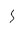{width="0.23958333333333334in" height="0.3229166666666667in"}{width="0.2708333333333333in" height="0.25in"}{width="0.3541666666666667in" height="0.4895833333333333in"}{width="0.2708333333333333in" height="0.3541666666666667in"}{width="1.6770833333333333in" height="1.7395833333333333in"}{width="1.6979166666666667in" height="1.75in"}{width="0.3541666666666667in" height="0.21875in"}{width="0.3020833333333333in" height="0.21875in"}{width="0.4479166666666667in" height="0.3125in"}{width="1.5729166666666667in" height="1.6354166666666667in"}{width="0.5104166666666666in" height="0.5416666666666666in"}{width="0.53125in" height="0.53125in"}{width="0.5625in" height="0.5833333333333334in"}{width="0.20833333333333334in" height="0.20833333333333334in"}{width="0.53125in" height="0.5416666666666666in"}{width="0.4791666666666667in" height="0.3020833333333333in"}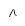{width="0.2604166666666667in" height="0.2708333333333333in"}{width="0.25in" height="0.2604166666666667in"}{width="0.23958333333333334in" height="0.3125in"}{width="0.6041666666666666in" height="0.5833333333333334in"}{width="0.5520833333333334in" height="0.5729166666666666in"}{width="0.3333333333333333in" height="0.4791666666666667in"}{width="0.25in" height="0.4270833333333333in"}{width="1.6458333333333333in" height="1.625in"}{width="1.625in" height="1.6875in"}{width="1.625in" height="1.65625in"}{width="1.5833333333333333in" height="1.6354166666666667in"}{width="0.5520833333333334in" height="0.59375in"}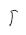{width="0.2708333333333333in" height="0.3645833333333333in"}{width="1.6458333333333333in" height="1.625in"}{width="1.2708333333333333in" height="0.9166666666666666in"}{width="0.40625in" height="0.5416666666666666in"}{width="1.625in" height="1.6875in"}{width="1.625in" height="1.65625in"}{width="0.19791666666666666in" height="0.19791666666666666in"}{width="0.53125in" height="0.5833333333333334in"}{width="0.53125in" height="0.5416666666666666in"}{width="0.53125in" height="0.5729166666666666in"}{width="0.3541666666666667in" height="0.3125in"}{width="0.3020833333333333in" height="0.3020833333333333in"}{width="0.53125in" height="0.5729166666666666in"}{width="1.34375in" height="1.0104166666666667in"}{width="0.5520833333333334in" height="0.5520833333333334in"}{width="0.3645833333333333in" height="0.2604166666666667in"}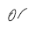{width="0.4166666666666667in" height="0.34375in"}{width="0.19791666666666666in" height="0.23958333333333334in"}{width="0.3333333333333333in" height="0.22916666666666666in"}{width="0.3229166666666667in" height="0.21875in"}{width="1.1666666666666667in" height="0.5208333333333334in"}{width="1.5729166666666667in" height="1.6354166666666667in"}{width="1.4166666666666667in" height="0.5833333333333334in"}{width="0.34375in" height="0.40625in"}{width="1.5520833333333333in" height="1.65625in"}{width="1.0208333333333333in" height="0.9375in"}{width="0.34375in" height="0.3645833333333333in"}{width="0.5416666666666666in" height="0.59375in"}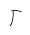{width="0.3125in" height="0.3645833333333333in"}{width="0.5416666666666666in" height="0.5729166666666666in"}{width="0.53125in" height="0.5729166666666666in"}{width="0.5416666666666666in" height="0.5729166666666666in"}{width="0.3125in" height="0.3854166666666667in"}{width="0.5833333333333334in" height="0.22916666666666666in"}{width="0.53125in" height="0.5625in"}{width="0.59375in" height="1.15625in"}{width="0.5520833333333334in" height="1.1458333333333333in"}{width="0.53125in" height="0.5416666666666666in"}{width="0.25in" height="0.20833333333333334in"}{width="1.5625in" height="1.6145833333333333in"}{width="0.4270833333333333in" height="0.4791666666666667in"}{width="0.3645833333333333in" height="0.625in"}{width="0.3125in" height="0.4375in"}{width="0.5833333333333334in" height="1.1458333333333333in"}{width="0.5833333333333334in" height="0.5729166666666666in"}{width="0.2708333333333333in" height="0.4479166666666667in"}{width="0.3020833333333333in" height="0.4166666666666667in"}{width="0.3125in" height="0.3125in"}{width="0.375in" height="0.4583333333333333in"}{width="0.34375in" height="0.21875in"}{width="0.3854166666666667in" height="0.28125in"}{width="0.23958333333333334in" height="0.3645833333333333in"}{width="1.5833333333333333in" height="1.6770833333333333in"}{width="0.375in" height="0.22916666666666666in"}{width="0.2708333333333333in" height="0.3020833333333333in"}{width="0.3333333333333333in" height="0.3125in"}{width="0.5416666666666666in" height="0.6145833333333334in"}{width="0.3229166666666667in" height="0.3229166666666667in"}{width="0.25in" height="0.2708333333333333in"}{width="0.375in" height="0.20833333333333334in"}{width="0.5416666666666666in" height="0.6041666666666666in"}{width="0.3125in" height="0.34375in"}{width="0.3333333333333333in" height="0.21875in"}{width="1.65625in" height="1.75in"}{width="1.6666666666666667in" height="1.71875in"}{width="0.5520833333333334in" height="0.5729166666666666in"}{width="0.3125in" height="0.21875in"}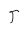{width="0.2916666666666667in" height="0.3333333333333333in"}{width="0.53125in" height="0.5520833333333334in"}{width="1.71875in" height="1.7291666666666667in"}{width="0.53125in" height="0.5625in"}{width="0.3645833333333333in" height="0.6666666666666666in"}{width="1.15625in" height="0.875in"}{width="0.53125in" height="0.5520833333333334in"}
-   Brittle - cleavage (see below)

{width="1.5520833333333333in" height="1.65625in"}{width="0.28125in" height="0.5208333333333334in"}{width="0.2916666666666667in" height="0.4895833333333333in"}{width="0.28125in" height="0.22916666666666666in"}{width="0.4375in" height="0.46875in"}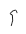{width="0.2708333333333333in" height="0.3541666666666667in"}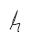{width="0.3020833333333333in" height="0.4166666666666667in"}{width="0.3125in" height="0.4166666666666667in"}{width="1.5729166666666667in" height="1.6041666666666667in"}{width="0.3854166666666667in" height="0.22916666666666666in"}{width="0.2708333333333333in" height="0.4270833333333333in"}{width="0.4583333333333333in" height="0.3125in"}{width="1.5416666666666667in" height="1.5833333333333333in"}{width="1.5416666666666667in" height="1.5833333333333333in"}{width="0.3229166666666667in" height="0.3020833333333333in"}{width="0.3125in" height="0.2708333333333333in"}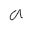{width="0.3229166666666667in" height="0.3020833333333333in"}{width="0.3020833333333333in" height="0.20833333333333334in"}{width="1.5in" height="1.5104166666666667in"}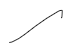{width="0.75in" height="0.53125in"}{width="0.23958333333333334in" height="0.3541666666666667in"}{width="0.2604166666666667in" height="0.20833333333333334in"}{width="1.5416666666666667in" height="1.5833333333333333in"}{width="1.5520833333333333in" height="1.6145833333333333in"}{width="0.3125in" height="0.28125in"}{width="1.5in" height="1.5in"}{width="0.5416666666666666in" height="0.4895833333333333in"}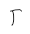{width="0.3125in" height="0.3541666666666667in"}{width="1.5in" height="1.5in"}{width="0.3125in" height="0.5104166666666666in"}{width="1.0208333333333333in" height="0.9375in"}{width="0.3125in" height="0.4479166666666667in"}{width="0.2708333333333333in" height="0.2604166666666667in"}{width="0.21875in" height="0.3125in"}{width="1.5in" height="1.5in"}{width="1.2395833333333333in" height="0.5416666666666666in"}{width="1.5729166666666667in" height="1.6041666666666667in"}{width="0.28125in" height="0.21875in"}{width="0.3125in" height="0.3645833333333333in"}{width="1.3854166666666667in" height="0.5416666666666666in"}{width="1.5625in" height="1.6041666666666667in"}{width="1.5416666666666667in" height="1.6041666666666667in"}{width="1.5625in" height="1.6041666666666667in"}{width="1.5625in" height="1.5416666666666667in"}{width="1.5625in" height="1.5416666666666667in"}{width="0.25in" height="0.2916666666666667in"}{width="1.5104166666666667in" height="1.5104166666666667in"}{width="1.5in" height="1.5104166666666667in"}{width="1.5729166666666667in" height="1.6041666666666667in"}{width="0.3333333333333333in" height="0.3645833333333333in"}{width="0.28125in" height="0.3854166666666667in"}{width="1.5625in" height="1.6041666666666667in"}{width="1.5625in" height="1.5416666666666667in"}{width="1.5625in" height="1.6458333333333333in"}{width="0.3333333333333333in" height="0.3645833333333333in"}{width="0.23958333333333334in" height="0.3020833333333333in"}{width="0.2604166666666667in" height="0.34375in"}{width="0.3333333333333333in" height="0.2604166666666667in"}{width="0.28125in" height="0.3020833333333333in"}{width="0.2604166666666667in" height="0.375in"}{width="0.3541666666666667in" height="0.3229166666666667in"}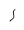{width="0.25in" height="0.3125in"}{width="0.23958333333333334in" height="0.2604166666666667in"}{width="1.5in" height="1.5104166666666667in"}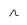{width="0.28125in" height="0.2604166666666667in"}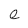{width="0.2916666666666667in" height="0.2916666666666667in"}{width="0.3333333333333333in" height="0.21875in"}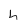{width="0.2708333333333333in" height="0.2916666666666667in"}{width="0.3229166666666667in" height="0.34375in"}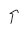{width="0.28125in" height="0.3333333333333333in"}{width="0.2708333333333333in" height="0.40625in"}{width="0.25in" height="0.2604166666666667in"}{width="0.25in" height="0.23958333333333334in"}{width="0.25in" height="0.25in"}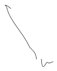{width="1.21875in" height="1.5208333333333333in"}{width="1.3541666666666667in" height="1.03125in"}{width="1.5416666666666667in" height="1.6041666666666667in"}{width="0.5729166666666666in" height="1.1666666666666667in"}{width="1.5833333333333333in" height="1.59375in"}{width="1.5520833333333333in" height="1.5833333333333333in"}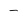{width="0.2708333333333333in" height="0.19791666666666666in"}{width="0.5520833333333334in" height="1.1041666666666667in"}{width="1.5520833333333333in" height="1.5833333333333333in"}{width="1.5104166666666667in" height="1.5104166666666667in"}{width="0.5208333333333334in" height="1.1666666666666667in"}{width="1.5104166666666667in" height="1.5104166666666667in"}{width="1.5208333333333333in" height="1.53125in"}{width="1.5208333333333333in" height="1.53125in"}{width="1.5416666666666667in" height="1.6041666666666667in"}{width="1.5208333333333333in" height="1.4895833333333333in"}{width="1.5520833333333333in" height="1.5833333333333333in"}{width="1.5208333333333333in" height="1.4895833333333333in"}{width="1.5104166666666667in" height="1.5104166666666667in"}{width="1.5208333333333333in" height="1.53125in"}{width="0.3020833333333333in" height="0.3125in"}{width="1.5208333333333333in" height="1.4895833333333333in"}{width="0.2708333333333333in" height="0.20833333333333334in"}{width="1.65625in" height="1.7291666666666667in"}{width="1.6041666666666667in" height="1.6354166666666667in"}{width="1.6041666666666667in" height="1.6354166666666667in"}{width="1.6770833333333333in" height="1.6666666666666667in"}{width="1.5833333333333333in" height="1.59375in"}{width="1.6458333333333333in" height="1.7083333333333333in"}{width="1.5625in" height="1.5833333333333333in"}{width="1.5in" height="1.5520833333333333in"}{width="1.6041666666666667in" height="1.65625in"}{width="1.5104166666666667in" height="1.5in"}{width="1.5104166666666667in" height="1.5104166666666667in"}{width="1.5in" height="1.5520833333333333in"}{width="1.6041666666666667in" height="1.6354166666666667in"}{width="1.6666666666666667in" height="1.71875in"}{width="1.5833333333333333in" height="1.59375in"}{width="1.5in" height="1.5520833333333333in"}{width="1.5104166666666667in" height="1.5104166666666667in"}{width="0.2708333333333333in" height="0.4583333333333333in"}
-   Very good conductors of heat and electricity - electrons are free to move
-   Malleable and ductile - electrons will hold particles together under many forces
-   Melting points vary

{width="0.3020833333333333in" height="0.25in"}{width="1.5625in" height="1.5833333333333333in"}{width="1.5520833333333333in" height="1.5729166666666667in"}{width="1.5520833333333333in" height="1.5729166666666667in"}{width="1.59375in" height="1.6041666666666667in"}{width="1.5104166666666667in" height="1.5208333333333333in"}{width="1.5104166666666667in" height="1.5in"}{width="1.5208333333333333in" height="1.5208333333333333in"}{width="1.5208333333333333in" height="1.5208333333333333in"}{width="0.3020833333333333in" height="0.22916666666666666in"}{width="0.3541666666666667in" height="0.8541666666666666in"}{width="1.5520833333333333in" height="1.5729166666666667in"}{width="1.5625in" height="1.5833333333333333in"}{width="0.20833333333333334in" height="0.19791666666666666in"}{width="1.5104166666666667in" height="1.5in"}{width="0.2708333333333333in" height="0.3125in"}{width="1.5208333333333333in" height="1.5208333333333333in"}{width="1.1666666666666667in" height="0.5625in"}{width="0.3854166666666667in" height="0.4270833333333333in"}{width="1.59375in" height="1.6041666666666667in"}{width="1.5104166666666667in" height="1.5208333333333333in"}{width="1.3645833333333333in" height="0.5208333333333334in"}{width="0.34375in" height="0.40625in"}{width="0.2916666666666667in" height="0.3854166666666667in"}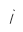{width="0.23958333333333334in" height="0.3333333333333333in"}{width="1.59375in" height="1.6041666666666667in"}{width="0.3125in" height="0.34375in"}{width="1.5104166666666667in" height="1.5208333333333333in"}{width="0.3125in" height="0.3854166666666667in"}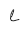{width="0.28125in" height="0.3125in"}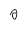{width="0.2604166666666667in" height="0.3020833333333333in"}{width="0.28125in" height="0.28125in"}{width="0.3020833333333333in" height="0.46875in"}{width="0.3645833333333333in" height="0.23958333333333334in"}{width="0.375in" height="0.3541666666666667in"}{width="0.3958333333333333in" height="0.40625in"}{width="0.3958333333333333in" height="0.3541666666666667in"}{width="0.2708333333333333in" height="0.3125in"}{width="0.3229166666666667in" height="0.2708333333333333in"}{width="0.34375in" height="0.25in"}{width="0.21875in" height="0.20833333333333334in"}{width="0.4375in" height="0.46875in"}{width="0.3333333333333333in" height="0.4479166666666667in"}{width="0.2604166666666667in" height="0.4166666666666667in"}{width="0.2708333333333333in" height="0.3854166666666667in"}{width="0.3020833333333333in" height="0.2708333333333333in"}{width="0.3229166666666667in" height="0.25in"}{width="0.28125in" height="0.4166666666666667in"}{width="0.3645833333333333in" height="0.3854166666666667in"}{width="0.25in" height="0.3020833333333333in"}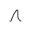{width="0.3125in" height="0.3125in"}{width="0.2916666666666667in" height="0.2916666666666667in"}{width="0.3020833333333333in" height="0.2708333333333333in"}{width="0.28125in" height="0.3020833333333333in"}{width="0.28125in" height="0.4791666666666667in"}{width="0.2708333333333333in" height="0.40625in"}{width="0.4375in" height="0.22916666666666666in"}{width="0.3125in" height="0.3645833333333333in"}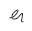{width="0.3333333333333333in" height="0.3229166666666667in"}{width="0.3020833333333333in" height="0.3229166666666667in"}{width="0.3020833333333333in" height="0.3229166666666667in"}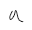{width="0.3333333333333333in" height="0.3125in"}{width="0.4166666666666667in" height="0.5416666666666666in"}{width="0.3229166666666667in" height="0.2604166666666667in"}{width="0.3125in" height="0.40625in"}{width="0.3541666666666667in" height="0.4583333333333333in"}
-   Formula represents actual number of atoms in each molecule
-   I2 => 2 iodine per molecule

{width="0.3125in" height="0.4270833333333333in"}{width="0.2708333333333333in" height="0.3854166666666667in"}{width="0.4375in" height="0.4166666666666667in"}{width="0.3333333333333333in" height="0.21875in"}{width="0.3020833333333333in" height="0.28125in"}{width="0.25in" height="0.3854166666666667in"}{width="0.28125in" height="0.28125in"}{width="0.3541666666666667in" height="0.3333333333333333in"}{width="0.375in" height="0.3333333333333333in"}{width="0.22916666666666666in" height="0.3541666666666667in"}{width="0.2708333333333333in" height="0.4791666666666667in"}{width="0.28125in" height="0.3229166666666667in"}{width="0.3020833333333333in" height="0.3958333333333333in"}{width="0.20833333333333334in" height="0.20833333333333334in"}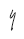{width="0.25in" height="0.40625in"}{width="0.2916666666666667in" height="0.2604166666666667in"}{width="0.3125in" height="0.3229166666666667in"}{width="0.3958333333333333in" height="0.3958333333333333in"}{width="0.3333333333333333in" height="0.22916666666666666in"}{width="0.34375in" height="0.2916666666666667in"}{width="0.22916666666666666in" height="0.2708333333333333in"}{width="0.2916666666666667in" height="0.2916666666666667in"}{width="0.22916666666666666in" height="0.25in"}{width="0.3020833333333333in" height="0.2708333333333333in"}{width="0.2604166666666667in" height="0.2604166666666667in"}{width="0.3958333333333333in" height="0.375in"}{width="0.2708333333333333in" height="0.3333333333333333in"}{width="0.23958333333333334in" height="0.2916666666666667in"}
-   Usually made out of carbon, boron, germanium, silicon = semimetals

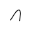{width="0.3020833333333333in" height="0.3125in"}{width="0.2708333333333333in" height="0.2604166666666667in"}{width="0.3333333333333333in" height="0.40625in"}{width="0.2916666666666667in" height="0.3125in"}{width="0.3645833333333333in" height="0.3020833333333333in"}
-   Formula represents ratio between ions
-   NO DISTINCT MOLECULES - only ratio is described by Formula
-   Poor conductors of electricity in solid state - ions are not free to move
-   Good conductors when liquid/aqueous

{width="7.854166666666667in" height="0.3854166666666667in"}{width="1.5520833333333333in" height="1.5833333333333333in"}{width="1.5729166666666667in" height="1.59375in"}{width="1.5520833333333333in" height="1.5833333333333333in"}{width="1.5520833333333333in" height="1.5833333333333333in"}{width="1.5520833333333333in" height="1.5833333333333333in"}
-   Graphite - also carbon, sp3 hybridized (3 bonds per atom)

{width="1.5729166666666667in" height="1.59375in"}{width="1.5729166666666667in" height="1.625in"}{width="1.5729166666666667in" height="1.6041666666666667in"}{width="1.5729166666666667in" height="1.59375in"}{width="1.59375in" height="1.5729166666666667in"}{width="1.59375in" height="1.5729166666666667in"}{width="1.59375in" height="1.5729166666666667in"}{width="1.59375in" height="1.5729166666666667in"}{width="0.6354166666666666in" height="0.6354166666666666in"}{width="0.71875in" height="0.5833333333333334in"}{width="0.5in" height="0.5520833333333334in"}{width="0.5in" height="0.5520833333333334in"}{width="0.5in" height="0.5520833333333334in"}{width="1.5729166666666667in" height="1.6041666666666667in"}{width="1.5729166666666667in" height="1.6041666666666667in"}{width="0.5in" height="0.5520833333333334in"}{width="0.5416666666666666in" height="0.5833333333333334in"}{width="1.5729166666666667in" height="1.6041666666666667in"}{width="0.625in" height="0.5833333333333334in"}{width="1.5729166666666667in" height="1.6041666666666667in"}{width="1.5625in" height="1.6145833333333333in"}{width="1.5416666666666667in" height="1.6041666666666667in"}{width="1.5833333333333333in" height="1.5833333333333333in"}{width="0.5208333333333334in" height="0.6875in"}{width="0.5520833333333334in" height="0.6979166666666666in"}{width="0.5in" height="0.5833333333333334in"}{width="0.5in" height="0.5833333333333334in"}{width="1.5833333333333333in" height="1.59375in"}{width="1.5833333333333333in" height="1.59375in"}{width="0.5in" height="0.5833333333333334in"}{width="0.5in" height="0.6979166666666666in"}{width="1.5833333333333333in" height="1.59375in"}{width="0.5in" height="0.5833333333333334in"}{width="1.5833333333333333in" height="1.59375in"}{width="1.5833333333333333in" height="1.6458333333333333in"}{width="1.5520833333333333in" height="1.6041666666666667in"}{width="1.5520833333333333in" height="1.6041666666666667in"}{width="0.5in" height="0.5416666666666666in"}{width="0.5in" height="0.5416666666666666in"}{width="0.5in" height="0.5416666666666666in"}{width="0.5in" height="0.5416666666666666in"}{width="1.6041666666666667in" height="1.59375in"}{width="1.6041666666666667in" height="1.59375in"}{width="0.6041666666666666in" height="0.6458333333333334in"}{width="1.6041666666666667in" height="1.59375in"}{width="1.6041666666666667in" height="1.59375in"}{width="0.6666666666666666in" height="0.6979166666666666in"}{width="0.7291666666666666in" height="0.65625in"}{width="0.6145833333333334in" height="0.625in"}{width="0.59375in" height="0.6145833333333334in"}{width="0.5729166666666666in" height="0.6145833333333334in"}{width="1.5520833333333333in" height="1.6041666666666667in"}{width="1.5625in" height="1.6145833333333333in"}{width="1.5729166666666667in" height="1.6145833333333333in"}
-   Example - Na (+) Cl(-) => NaCl
-   NaCl => 1Na, 1Cl

{width="0.5in" height="0.5729166666666666in"}{width="1.5625in" height="1.59375in"}{width="0.5in" height="0.5729166666666666in"}{width="1.5625in" height="1.59375in"}{width="0.5in" height="0.5729166666666666in"}{width="1.5625in" height="1.59375in"}{width="0.5in" height="0.5729166666666666in"}{width="1.5625in" height="1.59375in"}{width="0.53125in" height="0.6770833333333334in"}{width="0.5416666666666666in" height="0.6979166666666666in"}{width="0.5104166666666666in" height="0.6354166666666666in"}{width="1.5625in" height="1.625in"}{width="1.6875in" height="1.7395833333333333in"}{width="1.8333333333333333in" height="1.8645833333333333in"}{width="1.5520833333333333in" height="1.5729166666666667in"}{width="0.5in" height="0.5833333333333334in"}{width="1.5625in" height="1.59375in"}{width="0.5in" height="0.5833333333333334in"}{width="0.5in" height="0.5833333333333334in"}{width="0.5in" height="0.5833333333333334in"}{width="1.6875in" height="1.7395833333333333in"}{width="1.8333333333333333in" height="1.8645833333333333in"}{width="1.5520833333333333in" height="1.59375in"}{width="1.5520833333333333in" height="1.59375in"}{width="1.5520833333333333in" height="1.59375in"}{width="1.5520833333333333in" height="1.59375in"}{width="1.59375in" height="1.6041666666666667in"}{width="1.59375in" height="1.6041666666666667in"}{width="0.8020833333333334in" height="0.7395833333333334in"}{width="0.6145833333333334in" height="0.65625in"}{width="0.6354166666666666in" height="0.65625in"}{width="0.6666666666666666in" height="0.65625in"}{width="0.625in" height="0.5833333333333334in"}{width="0.5in" height="0.6041666666666666in"}{width="0.5in" height="0.6041666666666666in"}{width="0.5in" height="0.6041666666666666in"}{width="0.5in" height="0.6041666666666666in"}{width="1.8854166666666667in" height="1.9166666666666667in"}{width="1.8854166666666667in" height="1.9166666666666667in"}{width="1.6666666666666667in" height="1.7083333333333333in"}{width="1.6666666666666667in" height="1.7083333333333333in"}{width="0.22916666666666666in" height="0.2916666666666667in"}{width="0.34375in" height="0.3333333333333333in"}{width="0.21875in" height="0.4270833333333333in"}{width="0.3125in" height="0.34375in"}{width="0.3020833333333333in" height="0.5416666666666666in"}{width="0.2604166666666667in" height="0.3645833333333333in"}{width="0.25in" height="0.19791666666666666in"}{width="0.3125in" height="0.3854166666666667in"}{width="0.3020833333333333in" height="0.20833333333333334in"}{width="0.20833333333333334in" height="0.2708333333333333in"}{width="0.2604166666666667in" height="0.3854166666666667in"}{width="0.23958333333333334in" height="0.375in"}{width="0.28125in" height="0.2708333333333333in"}{width="0.22916666666666666in" height="0.19791666666666666in"}{width="0.3020833333333333in" height="0.20833333333333334in"}{width="0.2708333333333333in" height="0.28125in"}{width="0.25in" height="0.4479166666666667in"}{width="0.4895833333333333in" height="0.4166666666666667in"}{width="0.2708333333333333in" height="0.40625in"}{width="0.2916666666666667in" height="0.3541666666666667in"}{width="0.3125in" height="0.23958333333333334in"}{width="0.28125in" height="0.3645833333333333in"}{width="0.3645833333333333in" height="0.3854166666666667in"}{width="0.4270833333333333in" height="0.23958333333333334in"}{width="0.3333333333333333in" height="0.3125in"}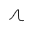{width="0.34375in" height="0.3125in"}{width="0.3229166666666667in" height="0.34375in"}{width="0.3020833333333333in" height="0.375in"}{width="0.3229166666666667in" height="0.3020833333333333in"}{width="0.2916666666666667in" height="0.20833333333333334in"}{width="0.2708333333333333in" height="0.4166666666666667in"}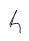{width="0.3020833333333333in" height="0.4270833333333333in"}{width="0.3125in" height="0.40625in"}{width="0.2604166666666667in" height="0.4270833333333333in"}{width="0.23958333333333334in" height="0.3854166666666667in"}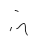{width="0.375in" height="0.4583333333333333in"}{width="0.375in" height="0.20833333333333334in"}{width="0.4270833333333333in" height="0.4791666666666667in"}{width="0.2708333333333333in" height="0.3958333333333333in"}{width="0.21875in" height="0.28125in"}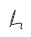{width="0.3229166666666667in" height="0.3854166666666667in"}{width="0.34375in" height="0.3958333333333333in"}{width="0.40625in" height="0.4479166666666667in"}{width="0.3229166666666667in" height="0.4270833333333333in"}{width="0.23958333333333334in" height="0.3645833333333333in"}{width="0.3125in" height="0.3958333333333333in"}{width="0.22916666666666666in" height="0.19791666666666666in"}{width="0.28125in" height="0.20833333333333334in"}{width="0.3229166666666667in" height="0.40625in"}{width="0.28125in" height="0.28125in"}{width="0.28125in" height="0.3958333333333333in"}{width="0.3541666666666667in" height="0.20833333333333334in"}{width="0.20833333333333334in" height="0.2708333333333333in"}{width="0.2916666666666667in" height="0.2708333333333333in"}{width="0.25in" height="0.20833333333333334in"}{width="0.2708333333333333in" height="0.3020833333333333in"}{width="0.34375in" height="0.4895833333333333in"}{width="0.4166666666666667in" height="0.4166666666666667in"}{width="0.3958333333333333in" height="0.4375in"}{width="0.3958333333333333in" height="0.3854166666666667in"}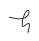{width="0.40625in" height="0.4270833333333333in"}{width="0.4583333333333333in" height="0.3645833333333333in"}{width="0.25in" height="0.3854166666666667in"}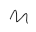{width="0.375in" height="0.3333333333333333in"}{width="0.3645833333333333in" height="0.23958333333333334in"}{width="0.34375in" height="0.3229166666666667in"}{width="0.2708333333333333in" height="0.3541666666666667in"}{width="0.3125in" height="0.3020833333333333in"}{width="0.4270833333333333in" height="0.2604166666666667in"}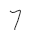{width="0.3020833333333333in" height="0.3958333333333333in"}

Examples
-   C6H12O6 - Molecular - all nonmetals
-   SiO2 - Covalent Network - silicon is a semimetal
-   SO2 - Molecular - all nonmetals
-   Na2CO3 - Ionic - Metal cation + CO3 (carbonate, anion polyatomic)
-   MgO - ionic - Metal cation + Nonmetal anion
-   Ba - metallic - is a metal

