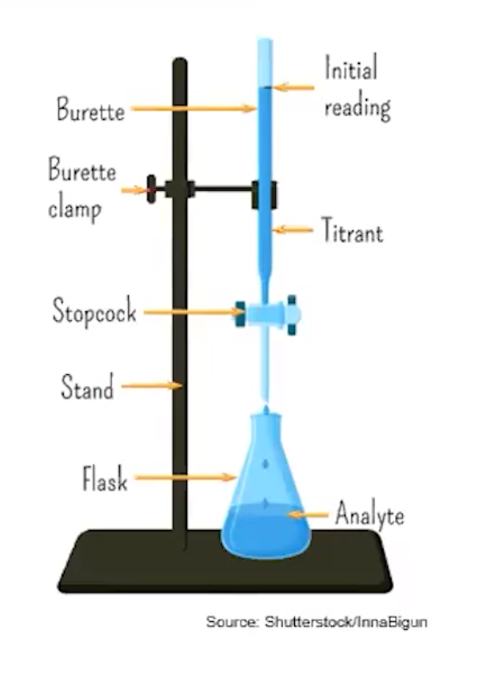
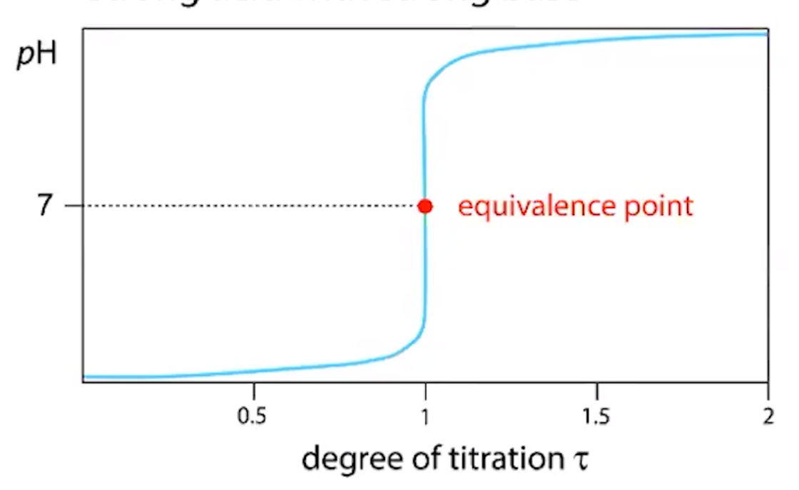

# Titration

**Titration** - an experimental technique where a substance of known concentration (the **standard solution**) is combined with a solution of unknown concentration to determine the amount of **moles** in the unknown
-   **Titrant** - usually the solution of known concentration

    -   In burette
-   **Analyte** - unknown, in the flask

{width="4.145833333333333in" height="5.885416666666667in"}
-   **Equivalence point**

    -   When the amount of titrant added (from the buret) has reacted with ALL the analyte

    -   Indicator that changes color is often added to show when the substance is close to the equivalence point

    -   **End point**

        -   When the indicator changes color
-   pH meter is often used to monitor progress in acid-base titration

    -   Produces a titration curve:

{width="6.395833333333333in" height="3.9270833333333335in"}
-   The point where the pH change is the greatest is the equivalence point
-   Where the amount of titrant needed to react with the analyte is determined

```{=html}
<!-- -->
```
-   Volume of analyte can then be calculated with equivalence point
-   Amount can be calculated with stoichiometric equations
-   Concentration = amount (mol) / volume (L)

**Redox Titrations**
-   Redox titrations can be used to determine concentration of an unknown solution
-   May not require the use of an indicator


