# Reaction Energy Profiles

Reaction Energy Profile:

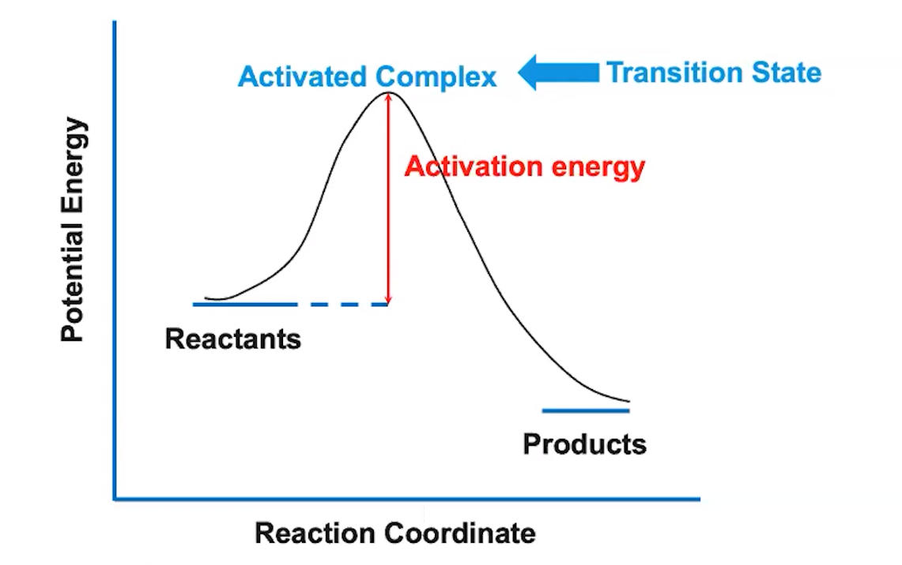{width="7.916666666666667in" height="4.96875in"}

-   Potential energy: quantifiable, J, kJ, etc
-   Reaction coordinate: not quantifiable, monitors progress of reaction over time
-   **Activation Energy:** energy required for the reaction to occur

    -   For the forward reaction: difference between the activation energy and the reactants:

    -   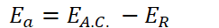{width="2.53125in" height="0.3333333333333333in"}

        -   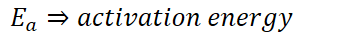{width="3.6041666666666665in" height="0.3333333333333333in"}

        -   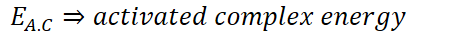{width="4.78125in" height="0.3333333333333333in"}

        -   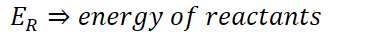{width="3.90625in" height="0.3333333333333333in"}
-   Activated complex:

    -   Bonds partially formed

    -   Bonds partially broken

    -   Structure is **committed** to forming the product

    -   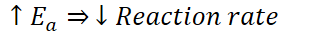{width="3.4583333333333335in" height="0.3333333333333333in"}

        -   Increases required collision energy => less c

        -   Collisions have the required energy
-   Endothermic reaction profile:

Reaction Energy Profile:
-   Temperature, activation energy, all other factors affecting reaction rate are all wrapped up in k (rate constant)

    -   {width="4.34375in" height="0.3333333333333333in"}

    -   {width="4.989583333333333in" height="0.3333333333333333in"}

    -   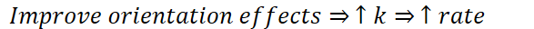{width="6.114583333333333in" height="0.3333333333333333in"}
-   Changing temperature DOES NOT CHANGE reaction profile

    -   Only changes the amount of collisions and the amount of collisions able to overcome activation energy (speeds up molecules)

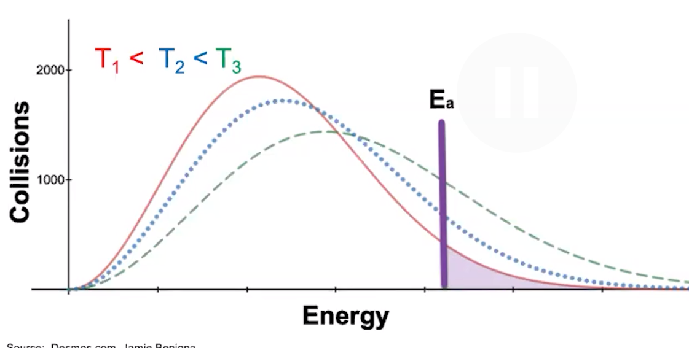{width="7.78125in" height="3.9375in"}

-   When a catalyst is used, activation energy decreases

    -   More collisions now have sufficient energy

    -   Reaction rate increase

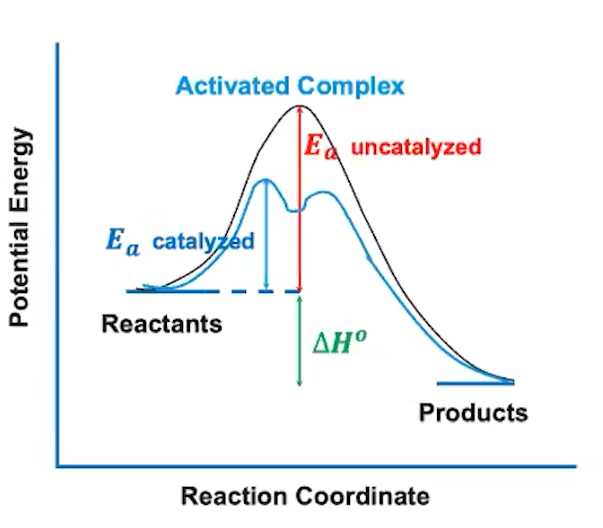{width="4.1875in" height="3.6666666666666665in"}
-   

, LE

,exothermic energy lost

being post

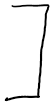{width="0.5520833333333334in" height="1.09375in"}

.

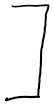{width="0.5520833333333334in" height="1.09375in"}

{width="0.7083333333333334in" height="0.125in"}

Enthalpy

(at)

At = Ep -E,

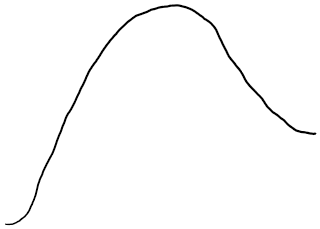{width="3.3333333333333335in" height="2.3854166666666665in"}

,

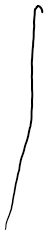{width="0.4895833333333333in" height="2.4375in"}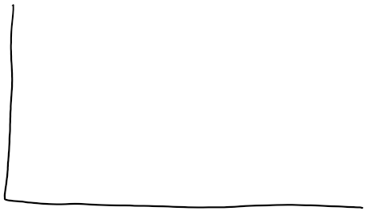{width="4.770833333333333in" height="2.7604166666666665in"}

activation

enemy

.

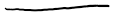{width="1.1770833333333333in" height="0.15625in"}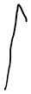{width="0.375in" height="1.1145833333333333in"}

Attis positive -Energy it sourced EPER

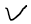{width="0.3229166666666667in" height="0.25in"}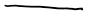{width="0.90625in" height="0.14583333333333334in"}

