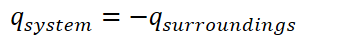
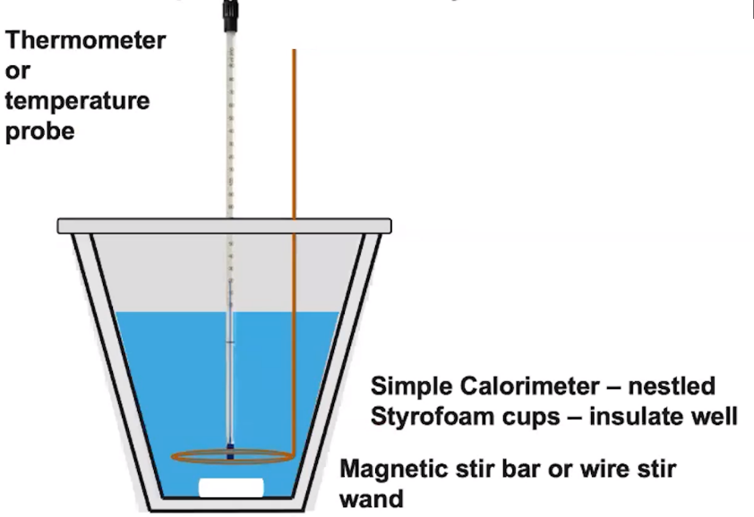
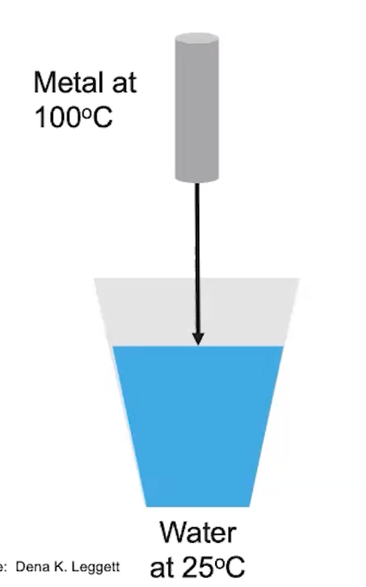
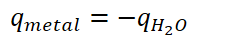
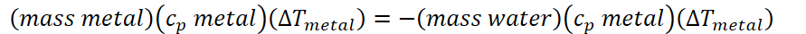
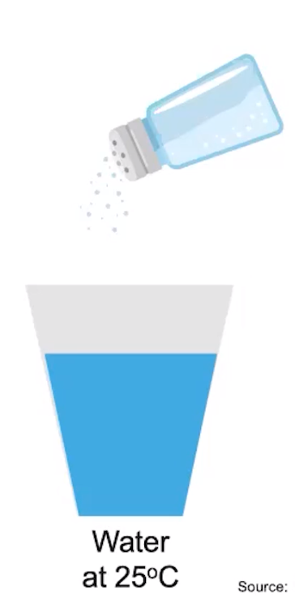
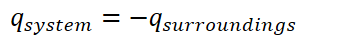
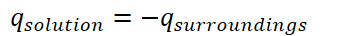
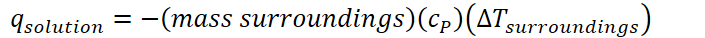

# Calorimetry

**Simple calorimeter**
-   Calorimetry: a method used to measure heat changes in an experiment

    -   {width="3.6458333333333335in" height="0.375in"}

        -   Same magnitude, opposite sign

{width="3.8229166666666665in" height="2.625in"}

**Heat transfer experiments:**
-   Hot metal dropped into water

{width="2.21875in" height="3.5520833333333335in"}
-   {width="2.53125in" height="0.375in"}

    -   {width="9.28125in" height="0.3958333333333333in"}

```{=html}
<!-- -->
```
-   Dissolving of an ionic salt

{width="2.5208333333333335in" height="5.09375in"}


-   {width="3.6458333333333335in" height="0.375in"}

    -   {width="3.7708333333333335in" height="0.375in"}

    -   {width="7.34375in" height="0.3958333333333333in"}

        -   When the salt dissolves, it becomes part of the surroundings

            -   Along with the sater


