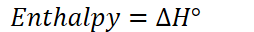
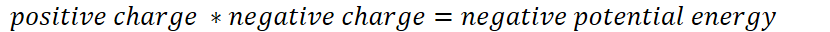
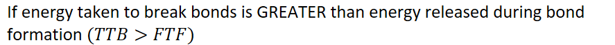
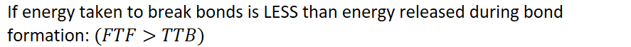
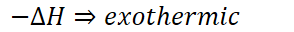
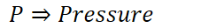
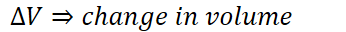
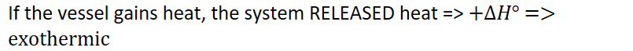

# Endothermic and exothermic processes

**The energy balancing act**
-   It takes energy to break bonds and attractive forces

    -   TTB - takes to break
-   Energy is freed when forming bonds and attractive forces

    -   FTF - frees to form
-   {width="7.625in" height="0.3541666666666667in"}
-   In a constant pressure system, the net energy change is called:

    -   {width="2.6458333333333335in" height="0.3333333333333333in"}
-   Example - a magnet

    -   Takes force to pull two magnets apart

        -   Process is **energetically unfavorable** - REQUIRES energy

    -   When two magnets are placed close to each other they stick together

        -   Process is **energetically favorable** - CREATES energy
-   Coulomb's law:

    -   {width="8.645833333333334in" height="0.3333333333333333in"}

    -   The more negative the potential energy, the more energetically favorable

        -   And vice versa

**System**
-   System - the part of the universe we are studying

    -   Where bonds are broken/formed, etc

    -   Molecular/ionic level

    ```{=html}
    <!-- -->
    ```
    -   {width="9.239583333333334in" height="0.6875in"}

        -   Net positive

        -   {width="3.2604166666666665in" height="0.3541666666666667in"}

        -   Energy is required - energy ENTERING the system

    -   {width="9.239583333333334in" height="0.6875in"}

        -   Net negative

        -   {width="3.0625in" height="0.3333333333333333in"}

        -   Energy is released - energy LEAVES the system

**Phase changes**
-   Solid => liquid => gas: ENDOthermic

    -   Intermolecular forces are broken to turn a solid to a liquid, liquid to a gas
-   Gas => liquid => solid: EXOthermic

    -   Intermolecular forces are formed to turn a gas to a liquid, liquid to a solid
-   Dissolving of an ionic salt: AMBIGUOUS change

    -   Both a physical and chemical change

        -   Ionic bonds are broken (chemical change)

            -   Often accompanied by temperature change

        -   Salt can be dissolved then gotten back by evaporating water

            -   Water can be vaporized, salt comes back

    -   Breaking: (+)

        -   Ionic bonds are broken (Ex. Na, Cl)

        -   Hydrogen bonds are broken between water molecules

    -   Making: (-)

        -   Ion-dipole attractions between ions and water molecules

**The surroundings**
-   First law of thermodynamics - energy cannot be created nor destroyed

    -   Where does the energy go, if released?

    -   Where does the energy come from, if required?

        -   The **surroundings**
-   **Work**

    -   {width="3.125in" height="0.3333333333333333in"}

        -   Change in volume by at a constant pressure

            -   {width="2.3645833333333335in" height="0.3333333333333333in"}

            -   {width="3.6041666666666665in" height="0.3333333333333333in"}

        -   Gas expansion => exothermic

        -   Gas compression => endothermic
-   Exothermic flow

    -   System can:

        -   {width="4.8125in" height="0.3541666666666667in"}

        -   {width="5.71875in" height="0.3541666666666667in"}
-   Endothermic flow

    -   System can:

        -   {width="4.854166666666667in" height="0.3541666666666667in"}

        -   {width="7.166666666666667in" height="0.3541666666666667in"}
-   Surroundings are everything that is external to the system
    -   Temperature probe
    -   Reaction vessel
    -   Bulk solution
    -   Hands
    -   System might exchange mass and/or energy with its surroundings
-   We measure our surroundings in the laboratory
    -   {width="8.385416666666666in" height="0.6770833333333334in"}


