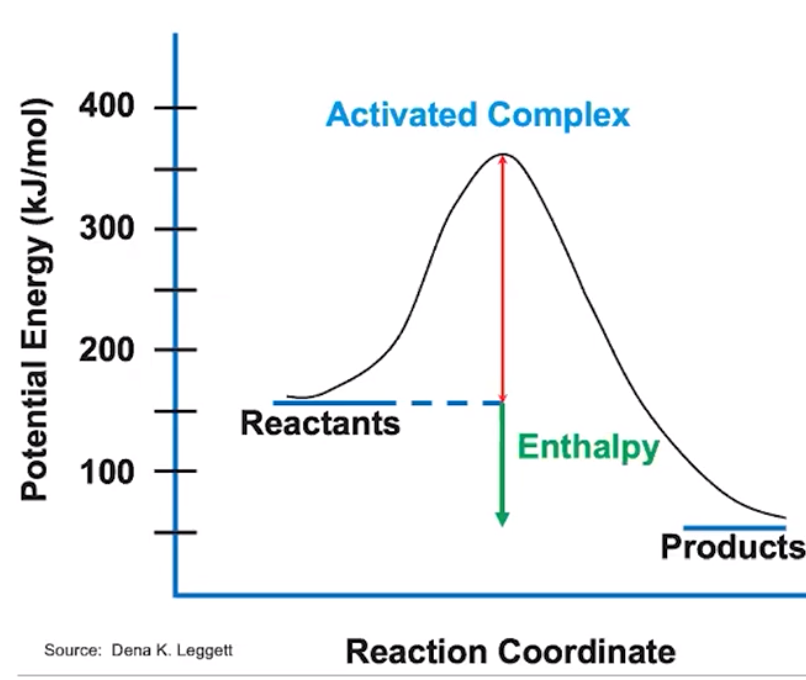
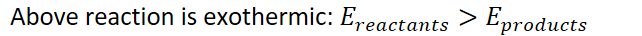
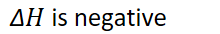
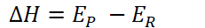
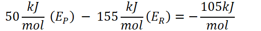
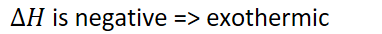
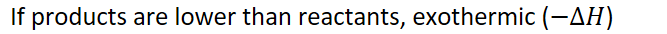
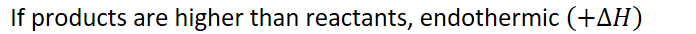

# Energy diagrams

Reaction energy profile
-   Y axis: potential energy (kJ/mol)
-   X axis: reaction coordinate (unquantifiable, left => right)
-   Line for reactants (left)
-   Line for products (right)
-   "Hump" for reaction energy barrier

{width="5.59375in" height="4.71875in"}
-   {width="6.6875in" height="0.375in"}

    -   {width="2.2916666666666665in" height="0.3541666666666667in"}

    -   {width="2.40625in" height="0.3333333333333333in"}

    -   {width="5.5in" height="0.65625in"}

    -   {width="3.9791666666666665in" height="0.3541666666666667in"}
-   {width="6.947916666666667in" height="0.3541666666666667in"}

    -   {width="7.25in" height="0.3541666666666667in"}
-   Lower energy => more stable

    -   Higher energy => less stable
-   Low => high energy = energetically unfavorable

    -   High => low energy = energetically favorable
-   Remember: the SURROUNDINGS are measured

    -   When measuring heat, SURROUNDINGS are measured

        -   This means when measured temperature increases, the reaction is EXOTHERMIC

