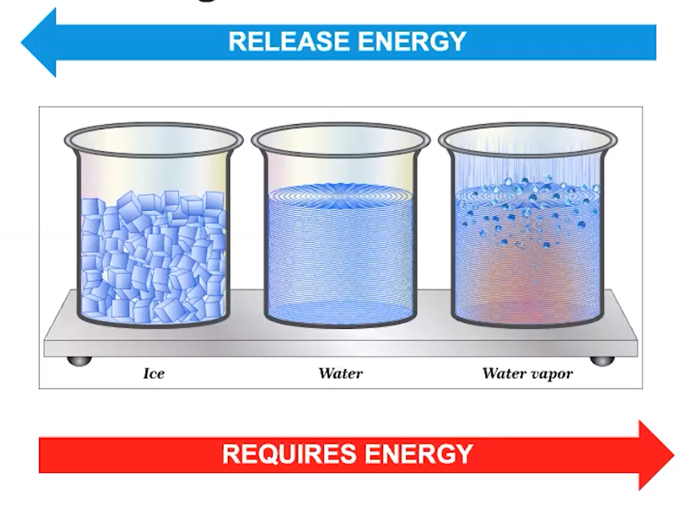
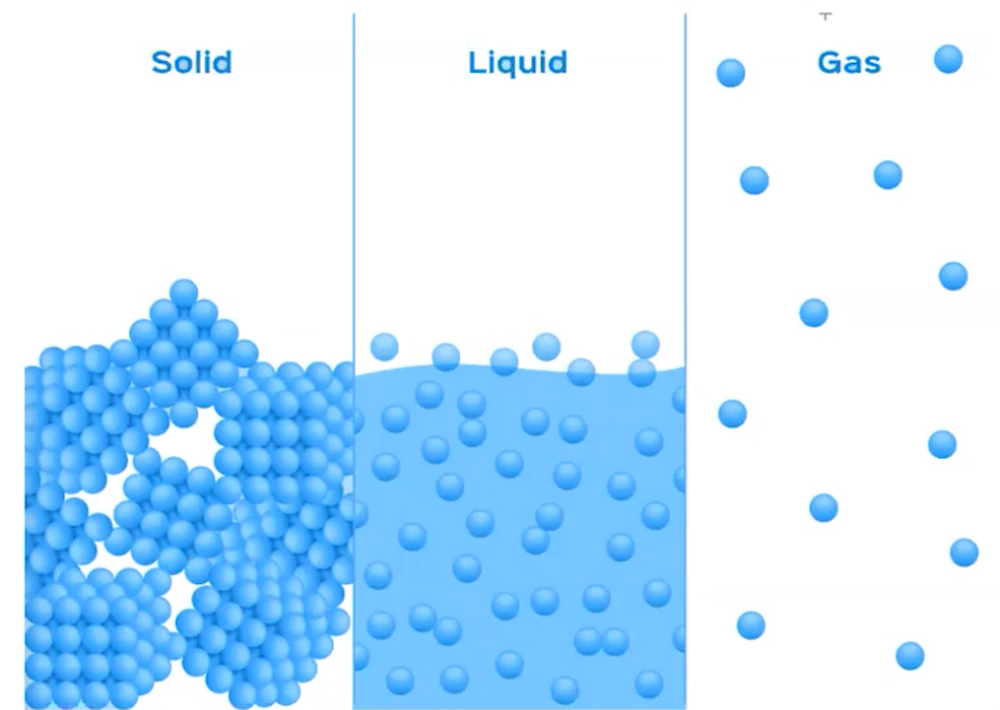
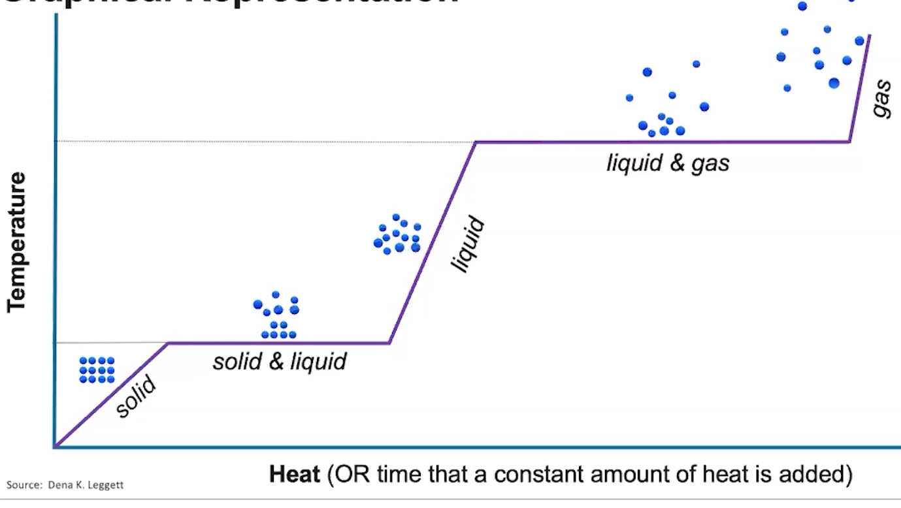
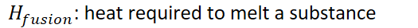
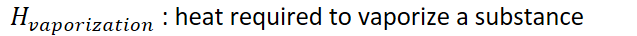
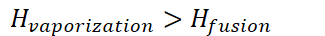

# Energy of phase changes
-   Energy of states

    -   Ice is at a very low potential energy

    -   Gas is at a very high potential energy

    -   Liquid is somewhere in the middle

    ```{=html}
    <!-- -->
    ```
    -   When going from a state with high potential energy, to one with low potential energy, energy will be released (exothermic)

        -   Creating attractive forces

    -   When going from a state with low potential energy to one with high potential energy, energy will be **required** (endothermic)

        -   Breaking attractive forces

{width="5.03125in" height="3.7708333333333335in"}
-   Molecular representation

    -   Intermolecular attractions are very prominent in solids, prominent in liquids, almost nonexistent in gases

        -   Water: hydrogen bonds in ice

    -   Takes energy to break those intermolecular attractions

    -   Releases energy when intermolecular attractions are formed

{width="5.010416666666667in" height="3.5625in"}
-   Require energy:

    -   Solid => liquid: melting

    -   Liquid => gas: vaporizing

```{=html}
<!-- -->
```
-   Release energy

    -   Gas => liquid: condensation

    -   Liquid => solid: freezing

```{=html}
<!-- -->
```
-   **Graphical representation**

{width="6.958333333333333in" height="3.9166666666666665in"}
-   Plateaus exist where both states are present

    -   During melting: solid **and** liquid

    -   During vaporization: liquid **and** gas
-   Temperature does not change during a phase change (plateaus)

    -   Energy goes into breaking/making attractions

        -   Melting point

        -   Boiling point

```{=html}
<!-- -->
```
-   {width="2.90625in" height="0.3541666666666667in"}
-   {width="5.145833333333333in" height="0.3541666666666667in"}

```{=html}
<!-- -->
```
-   **Heat capacity changes based on state**

    -   {width="7.979166666666667in" height="0.3541666666666667in"}

    -   {width="5.46875in" height="0.375in"}

    -   {width="6.635416666666667in" height="0.375in"}

    -   During phase changes: (endothermic)

        -   {width="5.96875in" height="0.375in"}

        -   {width="7.166666666666667in" height="0.375in"}

    ```{=html}
    <!-- -->
    ```
    -   In exothermic cooling, simply change the sign

        -   Energy is released when going from a gas to liquid, liquid to solid

        -   {width="4.59375in" height="0.375in"}

        -   {width="5.864583333333333in" height="0.375in"}

    -   **The wider the line segment is, the more energy it takes**

        -   Constant heat per time, takes longer time => more heat

    -   More attractive forces are broken going from a liquid to gas then a solid to liquid

        -   {width="3.3854166666666665in" height="0.375in"}

        -   Additionally, more energy is released when forming attractions from gas to liquid than when forming attractions from liquid to solid


