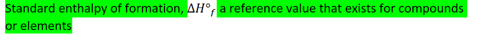
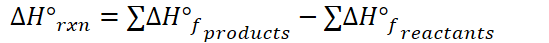
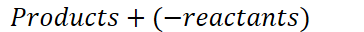
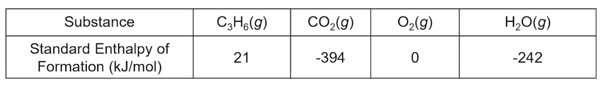
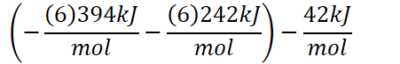
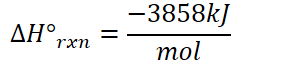

# Enthalpy of formation
-   {width="9.71875in" height="0.7083333333333334in"}

    -   Represents the change in enthalpy when a substance forms

    -   Can be used to estimate the overall enthalpy change of a reaction
-   {width="4.052083333333333in" height="0.3541666666666667in"}

    -   Specifies certain conditions

    -   Any enthalpy with the degree sign can be directly compared in an "apples to apples" comparison across substances

        -   For gases: 1 atm pressure

        -   For liquids and solids:

            -   Substance's most common, stable form at 1 atm, 25C

        -   For solutions:

            -   Concentration of 1M
-   Example:

    -   Standard enthalpy of formation of CO~2~: -393.5kJ/mol

        -   {width="8.479166666666666in" height="0.5in"}
-   {width="6.385416666666667in" height="0.375in"}

    -   {width="4.729166666666667in" height="0.5in"}
-   {width="8.40625in" height="0.375in"}

    -   {width="4.895833333333333in" height="0.5in"}
-   0 is "sea level", in standard state
-   **To calculate energy of a reaction using standard enthalpies**

    -   {width="5.71875in" height="0.4479166666666667in"}

        -   **Subtraction**

        -   **Products minus reactants**

            -   Standard enthalpies of **formation** must be REVERSED when reactants are being **broken**

                -   {width="3.7916666666666665in" height="0.3333333333333333in"}

    -   Example:

        -   {width="5.958333333333333in" height="0.3333333333333333in"}

        -   {width="8.041666666666666in" height="1.1458333333333333in"}

        -   {width="4.697916666666667in" height="0.7604166666666666in"}

        -   {width="4.625in" height="0.375in"}

        -   {width="4.333333333333333in" height="0.375in"}

        -   {width="2.9583333333333335in" height="0.65625in"}

