# Heat capacity
-   Heat capacity: the ability for a substance to absorb heat before the temperature rises

    -   The amount of energy (J) absorbed per temperature (C) increase

    -   The amount of heat (J or kJ) to raise the temperature 1 degree C or 1 K
-   2 types of heat capacity:

    -   Specific heat capacity

        -   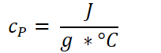{width="2.125in" height="0.7083333333333334in"}

            -   **Lowercase c**

            -   Joules per gram-degree Celsius

            -   {width="4.416666666666667in" height="0.3541666666666667in"}

            -   Degree Celsius or Kelvin

        -   {width="8.34375in" height="0.3541666666666667in"}

    -   Molar heat capacity

        -   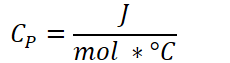{width="2.3958333333333335in" height="0.65625in"}

            -   **Uppercase C**

            -   Joules per mol-degree Celsius

            -   {width="4.416666666666667in" height="0.3541666666666667in"}

            -   Degree Celsius or Kelvin

        -   {width="8.333333333333334in" height="0.3541666666666667in"}
-   {width="7.458333333333333in" height="0.3541666666666667in"}

    -   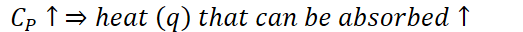{width="5.447916666666667in" height="0.3333333333333333in"}
-   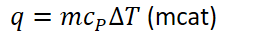{width="2.8125in" height="0.3541666666666667in"}

    -   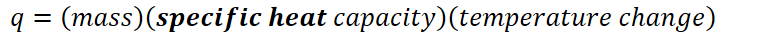{width="8.020833333333334in" height="0.3333333333333333in"}

    -   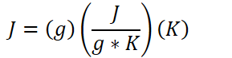{width="3.0104166666666665in" height="0.7604166666666666in"}

        -   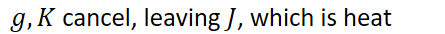{width="4.635416666666667in" height="0.3541666666666667in"}
-   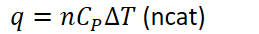{width="2.6979166666666665in" height="0.3541666666666667in"}

    -   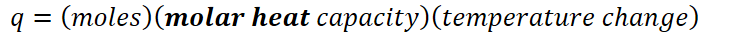{width="7.84375in" height="0.3333333333333333in"}

    -   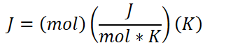{width="3.5729166666666665in" height="0.6458333333333334in"}

        -   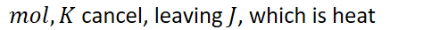{width="4.9375in" height="0.3541666666666667in"}
-   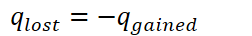{width="2.625in" height="0.375in"}

    -   Energy cannot be created nor destroyed, merely conserved

        -   Energy lost by one system is gained by another

