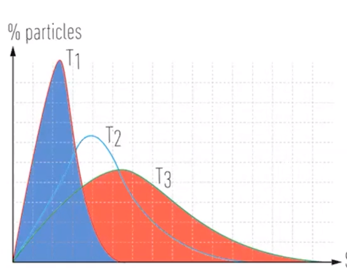
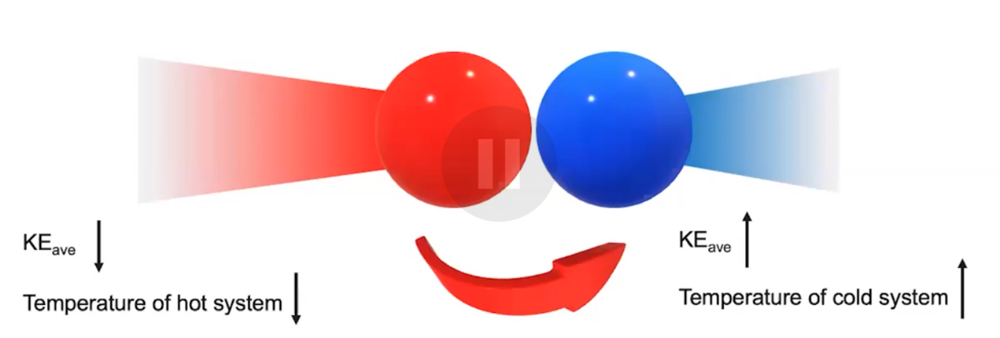

# Heat transfer and thermal equilibrium
-   Temperature is a measure of average kinetic energy

    -   In high temperature systems, molecules have on average a higher kinetic energy

    -   In low temperature systems, molecules have on average a lower kinetic energy

{width="3.4270833333333335in" height="2.6458333333333335in"}
-   Maxwell-Boltzmann distribution
-   Heat transfer

![Machine generated alternative text: Blocks Separated Heat Transfer Energy Blocks in Contact Blocks at Same Temperature No Further Heat Transfer Hot Atcms in hot block have 0000 0000 0000 0000 cold Atoms in axil block vibrate a little 00 000 0 0000 0000 Heat Transfers from Warmer to Cooler Atom's in hot block Atoms in ccx»l block lose kinetic em•rgy gain kinetic energy 000000 0 00000000 00000000 00000000 Molecular Kinetic is shared further net heat transfer Molecular View 00000 00 00000000 00000000 00000000 Molecular View Equalization of Temperatures ](../media/Unit-6-Heat-transfer-and-thermal-equilibrium-image2.png){width="7.979166666666667in" height="5.385416666666667in"}
-   Heat is transferred from high temperature (high energy) to low temperature (low energy) systems
-   Particles collide

    -   Particles with higher kinetic energy can collide with particles with lower and transfer some of the kinetic energy

{width="5.760416666666667in" height="1.9479166666666667in"}
-   Eventually, kinetic energy of all particles is equalized

    -   Thermal equilibrium

        -   Average kinetic energy is the same => both systems are at the same temperature

