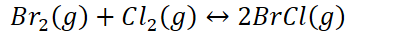
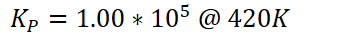
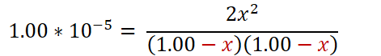
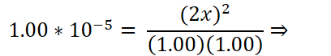
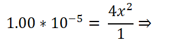
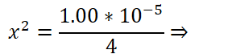
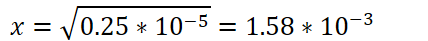

# Calculating equilibrium concentrations

How to use K and initial (before equilibrium) conditions to calculate equilibrium concentrations/pressures
-   2 sets of conditions: initial conditions (before equilibrium) and equilibrium conditions (after equilibrium is established)
-   Use the relative values of Q and K to show how to make the reaction reach equilibrium

    -   {width="6.875in" height="0.3541666666666667in"}

        -   Amount of products must decrease

        -   Reverse reaction is favored

    -   {width="6.802083333333333in" height="0.3541666666666667in"}

        -   Amount of products must increase

        -   Forward reaction is favored
-   Reaction does not go to completion: can't just use stoichiometry to calculate equilibrium concentrations

    -   Use ICE: initial, change, equilibrium to keep track of different values and calculate equilibrium conditions

        -   ICE table:

            -   {width="4.15625in" height="0.3333333333333333in"}

            -   {width="3.5833333333333335in" height="0.34375in"}

            -   {width="6.21875in" height="0.375in"}

        -   

<table><colgroup><col style="width: 29%" /><col style="width: 15%" /><col style="width: 14%" /><col style="width: 39%" /></colgroup><thead><tr class="header"><th></th><th>Br<sub>2</sub>(g)</th><th>Cl<sub>2</sub>(g)</th><th></th></tr></thead><tbody><tr class="odd"><td>Initial</td><td>1.00 atm</td><td>1.00 atm</td><td>0.00 atm</td></tr><tr class="even"><td>Change</td><td>-1x</td><td>-1x</td><td>+2x</td></tr><tr class="odd"><td><p>Equilibrium</p><p>(Add initial +change)</p></td><td>1.00-1x</td><td>1.00-1x</td><td>0+2x</td></tr></tbody></table>
-   {width="3.2916666666666665in" height="0.6145833333333334in"}
-   {width="8.979166666666666in" height="0.7291666666666666in"}

    -   {width="1.8645833333333333in" height="0.3541666666666667in"}

```{=html}
<!-- -->
```
-   2 methods to solve for x:

    -   {width="2.5104166666666665in" height="0.3541666666666667in"}

        -   Neglect X in the denominator

            -   {width="4.90625in" height="0.7291666666666666in"}

            -   For very small values of K, X will be so small that subtracting X in the denominator yields essentially no change

            ```{=html}
            <!-- -->
            ```
            -   {width="4.25in" height="0.7291666666666666in"}

            -   {width="3.1979166666666665in" height="0.6979166666666666in"}

            -   {width="3.0in" height="0.6979166666666666in"}

            -   {width="4.458333333333333in" height="0.4270833333333333in"}

        ```{=html}
        <!-- -->
        ```
        -   Plug into ICE table

            -   

<table><colgroup><col style="width: 17%" /><col style="width: 28%" /><col style="width: 28%" /><col style="width: 26%" /></colgroup><thead><tr class="header"><th></th><th>Br<sub>2</sub>(g)</th><th>Cl<sub>2</sub>(g)</th><th></th></tr></thead><tbody><tr class="odd"><td>Initial</td><td>1.00 atm</td><td>1.00 atm</td><td>0.00 atm</td></tr><tr class="even"><td>Change</td><td></td><td></td><td></td></tr><tr class="odd"><td><p>Equilibrium</p><p>(Add initial +change)</p></td><td></td><td></td><td></td></tr></tbody></table>
-   If numerator and denominator are perfect squares:

    -   Square both sides and solve:

        -   {width="7.760416666666667in" height="0.8333333333333334in"}

        -   {width="4.572916666666667in" height="1.0in"}

        -   {width="3.3333333333333335in" height="0.65625in"}

        -   {width="4.104166666666667in" height="0.3333333333333333in"}

        -   {width="4.104166666666667in" height="0.3333333333333333in"}

        -   {width="3.4583333333333335in" height="0.3333333333333333in"}

        -   {width="2.4791666666666665in" height="0.65625in"}

        -   {width="2.53125in" height="0.34375in"}

    ```{=html}
    <!-- -->
    ```
    -   Plug into ICE table


{width="0.6666666666666666in" height="0.3333333333333333in"}


