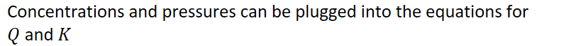
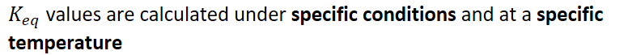
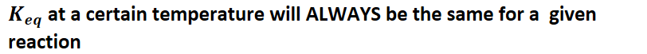

# Calculating equilibrium constant
-   {width="8.458333333333334in" height="0.6875in"}
-   {width="8.0in" height="0.375in"}

    -   {width="8.083333333333334in" height="0.7083333333333334in"}

    -   {width="6.135416666666667in" height="0.375in"}
-   {width="8.458333333333334in" height="0.7083333333333334in"}

    -   {width="4.84375in" height="0.3541666666666667in"}

    -   {width="5.197916666666667in" height="0.5416666666666666in"}
-   Everything in the numerator (products) will be directly proportional to K

    -   Make sure to still account for exponents

        -   Exponent of 2 means that K will be directly proportional to the **square of** the concentration
-   Everything in the denominator (reactants) will be inversely proportional to K

    -   Account for exponents

