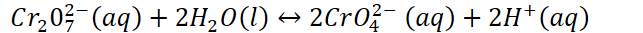
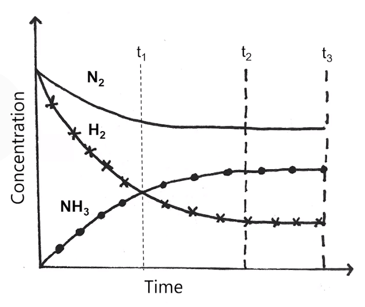

# Intro to equilibrium
-   Many chemical and physical changes are reversible

    -   All phase changes are reversible - ice can melt then refreeze

    -   Dissolved salts can precipitate out then dissolve again
-   Many chemical reactions are reversible

    -   {width="6.697916666666667in" height="0.34375in"}

        -   Left to right reaction: **forward reaction**

        -   Right to left reaction: **reverse reaction**

    -   Some reversible processes:

        -   Loss and gain of protons in acid-base reactions

        -   Loss and gain of electrons in redox reactions
-   Equilibrium: the state at which concentrations of all reactants and products remain constant with time

    -   In reversible reactions, the forward and reverse reactions will eventually "settle down" and proceed at the same rate

    -   **Rates of forward and reverse reactions are equal => no net change => reaction is at equilibrium**

        -   Reactants collide and form products, products then collide with each other and form reactants

            -   These two things will eventually equalize

    -   At equilibrium, concentrations of products DO NOT have to be the same

        -   Only the rates of forward and reverse reactions have to be equal

    -   Reaction will look like it has stopped - no observable change

        -   Equilibrium is **dynamic**: forward and reverse reactions are still happening, just at the same rate

        -   Concentrations of products and reactants **do not change**

        -   **However, the concentrations are not necessarily equal**

{width="5.03125in" height="4.239583333333333in"}
-   T1: **equal concentration: does not signify equilibrium**
-   T2: **no observable change in concentration: reaction is at equilibrium**

    -   Curves "level out"

