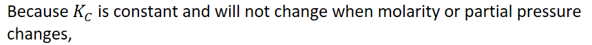
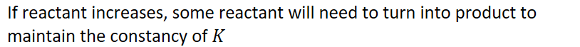
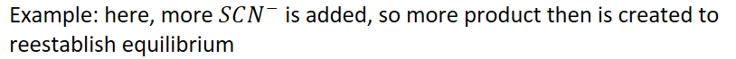

# Le Chatalier's Principle

What did Le Chatalier discover?
-   Changing the reaction conditions of a system can knock the system out of equilibrium

    -   Called **stressing** an equilibrium system

    -   A system can be stressed by changing:

        -   Molarity

        -   Partial pressure

        -   Temperature

        -   Volume

        -   Pressure

    -   When an equilibrium system is stressed, the system will shift to reduce the stress and re-establish equilibrium
-   What happens in response to the stress?

    -   If substance is added, subtract in response to the stress

    -   If substance is removed, replace in response to the stress

    -   Species can be removed with side reactions, like neutralization or precipitation

    -   **Catalyst: does not stress an equilibrium system**

        -   Increases the rate in **both** directions

    -   **Adding solid: does not stress**

        -   Does not modify the K equation

        -   As long as there is some solid to show the system is at equilibrium, more solid does not matter

    -   **For molarity or partial pressure:**

        -   K does not change

        -   {width="8.958333333333334in" height="0.6875in"}

            -   Products and reactants will redistribute in response to the stress

            -   {width="8.479166666666666in" height="0.6875in"}

![qu brium [FeSCN]2+ STRESS SCN- Equi um Re-established time ](../media/Unit-7-Le-Chatalier's-Principle-image3.png){width="4.635416666666667in" height="3.5833333333333335in"}
-   {width="8.479166666666666in" height="0.6875in"}
-   {width="5.739583333333333in" height="0.3541666666666667in"}

    -   The formation of more product from reactant is the **response** to the stress

        -   Usually the answer to the question

```{=html}
<!-- -->
```
-   If something is added, it might react with the existing reactants or products and stress the system

    -   Example: adding something that will form a solid with one of the reactants, removing some of that reactant

```{=html}
<!-- -->
```
-   **Diluting or concentrating:**

    -   K does not change

    -   Molarities will change

        -   May not change at a 1:1 ratio:

            -   If there is more than 1 aqueous species in the numerator/denominator

                -   Side with the greatest number of aqueous species (including exponents) will be affected the most

```{=html}
<!-- -->
```
-   **Changing pressure**

    -   K does not change

    -   Increasing pressure/decreasing volume:

        -   Since moles of gas is directly proportional to pressure,

            -   Lowering moles of gas can relieve a stress due to increasing pressure/decreasing volume

        -   Increasing pressure/decreasing volume: causes the system to shift to the side with the **fewest** moles of gas

        -   Same as with concentrating solution: all pressures increase

            -   Side with more moles of gas will grow larger

            -   If reactants have more moles than products, increasing pressure would make reactants > products

                -   Therefore, reactants would need to be consumed and make products

    -   Decreasing pressure/increasing volume

        -   Causes system to shift to the side with the most moles of gas

            -   All pressures decrease => side with more moles is affected the greatest

                -   Side with the most moles decreases more
-   **Changing temperature:**

    -   **K will change**

    -   When temperature is changed: a NEW equilibrium is formed

        -   Different K value (K value is dependent on heat)

    -   **Addition** of heat **favors the endothermic** direction

        -   Endothermic direction consumes that heat to help relieve the stress

        -   If the reaction is (forward) endothermic:

            -   Consumes added heat

            -   Favors products

            -   New K value > old K value

        -   If the reaction is (forward) exothermic:

            -   **Reverse** reaction consumes added heat

            -   Favors reactants

            -   New K value < old K value

    -   **Decreasing** heat favors **exothermic** direction

        -   Exothermic reaction will **replace** the lost heat to help relieve stress

        -   If reaction is endothermic:

            -   Reverse reaction creates heat

            -   Favors reactants

            -   New K < old K

        -   If reaction is exothermic

            -   Forward reaction creates heat

            -   Favors products

            -   New K > old K


