# Magnitude of Equilibrium Constant

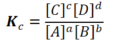{width="2.3854166666666665in" height="0.7291666666666666in"}

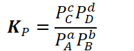{width="2.0208333333333335in" height="0.78125in"}
-   Products are in the numerator => directly proportional to K
-   Products in the denominator => inversely proportional to K
-   Therefore,

    -   If products are favored, K will be larger

    -   If reactants are favored, K will be smaller

**The magnitude (amount) of K can tell us how the concentrations of products and reactants will compare at equilibrium**
-   {width="1.6666666666666667in" height="0.3541666666666667in"}

    -   There are more products than reactants at equilibrium

        -   Products are favored: numerator larger than denominator

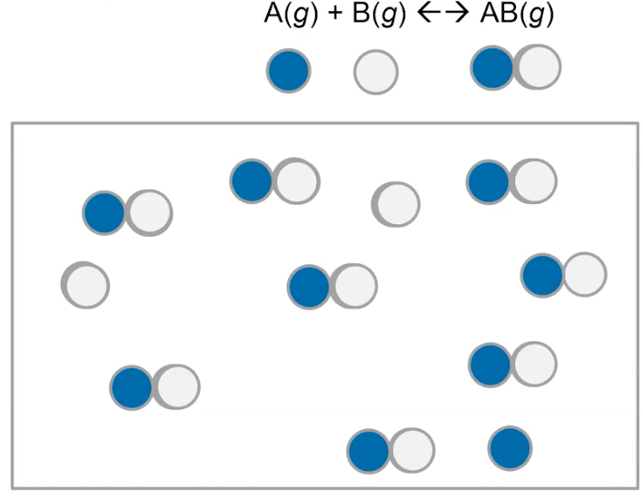{width="3.8958333333333335in" height="3.0208333333333335in"}
-   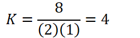{width="2.5in" height="0.6875in"}
-   **Products are favored:** count 8 particles of products, 3 particles of reactants

    -   **Concentration of products higher than concentration of reactants @ equilibrium**

```{=html}
<!-- -->
```
-   {width="1.6666666666666667in" height="0.3541666666666667in"}

    -   Approximately equal concentrations of products and reactants at equilibrium

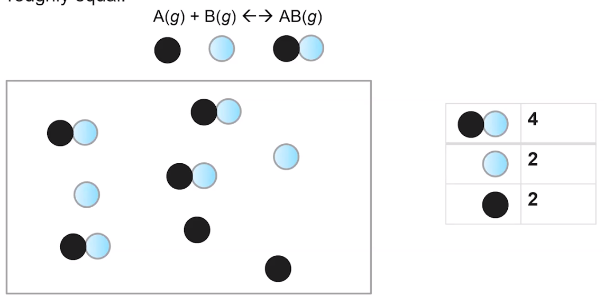{width="5.59375in" height="2.8333333333333335in"}
-   Count 4 AB, 2A and 2B:

    -   4 particles of products, 4 particles of reactants => **neither is favored**

        -   Concentration of reactants and products are approx. the same

    -   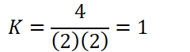{width="2.5in" height="0.6875in"}

```{=html}
<!-- -->
```
-   {width="1.6666666666666667in" height="0.3541666666666667in"}

    -   More reactants than products at equilibrium

        -   **Reactants are favored, concentration of reactants higher than concentration of products @ equilibrium**

        -   Denominator (reactants) larger than denominator (products)

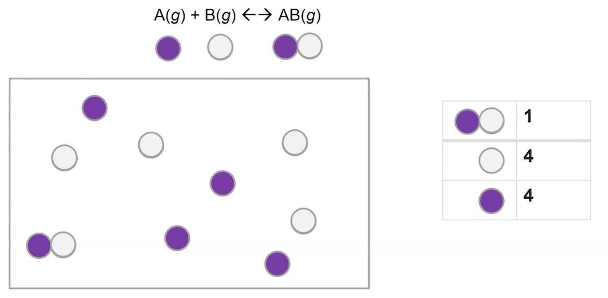{width="5.145833333333333in" height="2.5208333333333335in"}
-   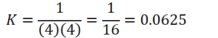{width="3.84375in" height="0.6875in"}
-   NOTE: K will never be zero or negative - may be very small, but never negative

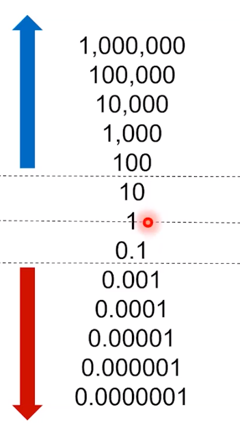{width="2.4375in" height="4.40625in"}
-   {width="8.385416666666666in" height="0.3541666666666667in"}

    -   Reaction goes to completion
-   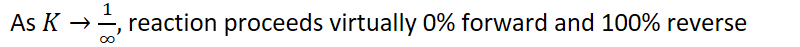{width="8.333333333333334in" height="0.4895833333333333in"}

    -   K will never be zero
-   {width="8.1875in" height="0.3541666666666667in"}

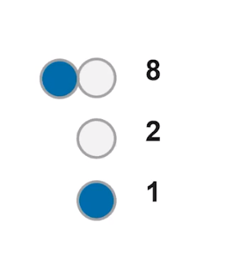{width="2.0104166666666665in" height="2.21875in"}


