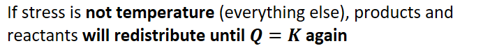
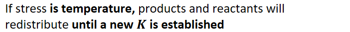
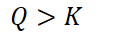
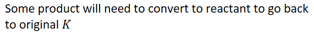
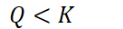

# Reaction quotient and Le Chatalier's principle

Reaction quotient Q and stress
-   {width="3.15625in" height="0.3541666666666667in"}
-   {width="4.322916666666667in" height="0.3541666666666667in"}

    -   {width="7.3125in" height="0.6875in"}

    -   {width="7.3125in" height="0.6875in"}
-   Examples:

    -   If increase product or decrease reactant:

        -   {width="1.4166666666666667in" height="0.3333333333333333in"}

            -   Too much product/not enough reactant

            -   {width="6.666666666666667in" height="0.6875in"}

    -   If decrease product or increase reactant:

        -   {width="1.4166666666666667in" height="0.3333333333333333in"}

            -   Not enough product/too much reactant

            -   Some reactant will need to convert to product to go back to original K

