# Reaction quotient and equilibrium constant

{width="3.0in" height="0.3541666666666667in"}
-   For a reversible reaction, the relative quantities of reactants and products at any point in time as a **ratio of products to reactants**

    -   {width="4.802083333333333in" height="0.3541666666666667in"}

    -   {width="5.666666666666667in" height="0.3541666666666667in"}

        -   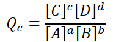{width="2.3541666666666665in" height="0.7291666666666666in"}

            -   C and D are products, always go in the numerator

            -   A and B are reactants, always go in the denominator

            -   a, b, c, d: coefficients

            -   A, B, C, D: chemical species

            -   {width="3.8854166666666665in" height="0.3541666666666667in"}

            -   Brackets => "concentration of" => molarity

        -   For gas-phase reactions, the reaction quotient can be written in terms of pressures:

            -   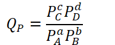{width="1.9791666666666667in" height="0.78125in"}

                -   {width="3.3229166666666665in" height="0.3541666666666667in"}

                -   Instead of concentrations, partial pressures are used (atm, torr, etc)

                -   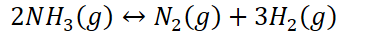{width="4.072916666666667in" height="0.3333333333333333in"}

                    -   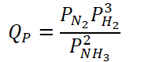{width="2.15625in" height="0.8229166666666666in"}

                    -   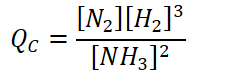{width="2.4791666666666665in" height="0.7395833333333334in"}

                    -   These two are different!

    -   **Solids and pure liquids (s, l) are NOT included in reaction quotient**

        -   Do not exert pressure or have concentrations

            -   Only gases (g) and aqueous solutions (aq) are included

            -   {width="5.90625in" height="0.3541666666666667in"}

                -   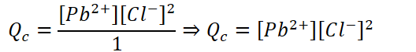{width="5.5in" height="0.6979166666666666in"}

                -   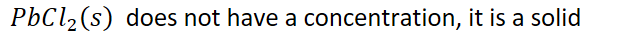{width="6.604166666666667in" height="0.3541666666666667in"}

    -   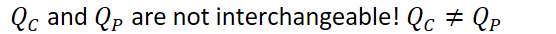{width="5.791666666666667in" height="0.3541666666666667in"}
-   Powers of 1 (coefficient 1) are understood and not written

{width="3.3333333333333335in" height="0.3541666666666667in"}
-   {width="9.875in" height="0.3541666666666667in"}

    -   {width="5.666666666666667in" height="0.3541666666666667in"}

        -   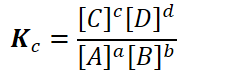{width="2.3854166666666665in" height="0.7291666666666666in"}

        -   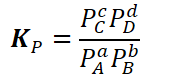{width="2.0208333333333335in" height="0.78125in"}

    -   {width="9.916666666666666in" height="0.6875in"}

        -   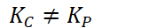{width="1.65625in" height="0.3333333333333333in"}

    -   {width="5.927083333333333in" height="0.3541666666666667in"}

**Why both?**
-   **Q** will tell us whether the reaction will need to proceed in the **forward or reverse direction** to reach equilibrium

    -   {width="8.354166666666666in" height="0.3541666666666667in"}
-   **K** will tell us whether there are more products or reactants present **at equilibrium**

    -   {width="8.802083333333334in" height="0.3541666666666667in"}

