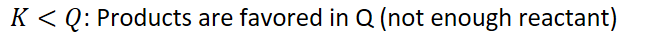
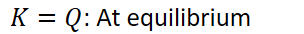
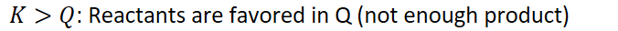

# Representations of equilibrium

Particle diagram representations of systems at equilibrium
-   Calculate equilibrium constant for the given equilibrium particle diagram:

    -   ![At equilibrium [Z] (12) Source: Dena K. L eggett ](../media/Unit-7-Representations-of-equilibrium-image1.png){width="2.8854166666666665in" height="4.40625in"}

    -   Compare K at equilibrium with reaction quotient Q of other diagrams

        -   {width="6.989583333333333in" height="0.3541666666666667in"}

            -   Consume product, form reactant to reach equilibrium

        -   {width="3.1666666666666665in" height="0.3541666666666667in"}

        -   {width="7.041666666666667in" height="0.3541666666666667in"}

            -   Consume reactant, form product to reach equilibrium

    -   Make a chart with particle diagrams for organization

