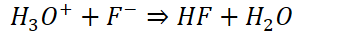

# pH and Solubility
-   {width="8.979166666666666in" height="0.6875in"}
-   Solubility of these compounds is very sensitive to addition of acids and bases

    -   {width="2.0208333333333335in" height="0.3541666666666667in"}

    -   {width="2.0625in" height="0.3541666666666667in"}
-   Very similar to common-ion effect, except with hydronium/hydroxide

    -   No calculations - all conceptual
-   Example:

    -   {width="5.28125in" height="0.34375in"}

    -   If more hydronium is added,

    -   Products will increase

    -   {width="1.84375in" height="0.375in"}
-   {width="4.510416666666667in" height="0.3541666666666667in"}

    -   {width="8.604166666666666in" height="0.6875in"}

        -   {width="8.291666666666666in" height="0.3541666666666667in"}

            -   Some of the hydroxide will react and form water
-   Adding acid to salt with a weak conjugate base:

    -   {width="4.552083333333333in" height="0.34375in"}

    -   {width="2.6770833333333335in" height="0.3541666666666667in"}

    -   {width="3.6145833333333335in" height="0.3333333333333333in"}

    -   {width="6.760416666666667in" height="0.375in"}
-   Take note of disassociation of added soluble compounds!

