# Acid-Base Titrations

When doing a titration with an acid and a base:
-   Acid usually in beaker
-   Base usually in burette

    -   Titrant: usually in burette, slowly dropped into analyte (in beaker)
-   Indicator will change color: indicator should change color close to equivalence point
-   For DATA:

    -   Burette: Initial/final volume, molarity

        -   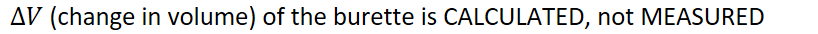{width="8.520833333333334in" height="0.3541666666666667in"}

    -   Beaker: Volume, molarity, mass

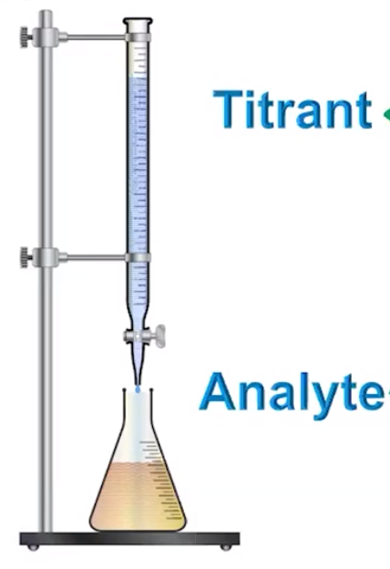{width="2.96875in" height="4.333333333333333in"}
-   Points:

    -   Starting point: when no titrant has been added

    -   End point: **when the indicator** undergoes a color change

    -   Equivalence point: when enough titrant has been added to completely react with the analyte
-   Titration curve **for strong acid and strong base**:

    -   Equivalence point: when the amount of titrant and analyte are equal for strong acids and strong bases

        -   Strong acids and strong bases auto-disassociate, cancelling each other out

        -   **Molarity of acid = molarity of conjugate base**

        -   The acid and base would have neutralized each other perfectly

        -   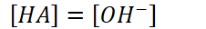{width="2.3541666666666665in" height="0.3333333333333333in"}

        -   However, strong acids have conjugate bases that DO NOT react with water

            -   Auto-disassociation of water will direct the pH

        -   Point at which change in pH is the greatest relative to base added

![14 7 [НА] > гон- А [НА] only РН due to excess Н + [НАД < [он- А [НА] = [ОН-] он- equiv.pt. ](../media/Unit-8-Acid-Base-Titrations-image4.png){width="4.864583333333333in" height="3.15625in"}
-   Used to calculate unknown molarities

    -   Known volume of titrant of known molarity is added

        -   Moles can be determined by titrant

        -   Use mole-to-mole ratio to determine moles of analyte

        -   Use moles analyte and volume of analyte to determine molarity
-   For weak acids/bases:

    -   Dilution

        -   VMVM

    -   Stoichiometry

        -   How much conjugate is formed?

    -   Equilibrium with conjugate and water
-   Titration curve for **weak acid and strong base:**

![[HQ] = [Q 1 eauiv.Dt. [Q pH: Q¯( becau ](../media/Unit-8-Acid-Base-Titrations-image5.png){width="4.59375in" height="3.1770833333333335in"}
-   Starting point will be from **equilibrium point**

    -   Acid has partially disassociated in water

    -   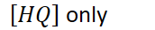{width="1.7916666666666667in" height="0.3541666666666667in"}
-   At equivalence point:

    -   {width="1.8125in" height="0.3541666666666667in"}

    -   {width="6.104166666666667in" height="0.3541666666666667in"}

    -   However, conjugate bases of weak acids DO react with water

    -   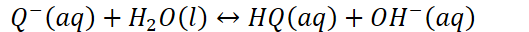{width="5.510416666666667in" height="0.3333333333333333in"}

    -   pH at equivalence point will be a bit basic

        -   Because of reaction of conjugate base disassociating with water

        -   NOT because of the titrant is a strong base
-   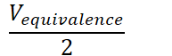{width="2.0104166666666665in" height="0.65625in"}

    -   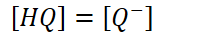{width="2.15625in" height="0.3333333333333333in"}

    -   Half of weak acid has been neutralized

    -   {width="1.8541666666666667in" height="0.3333333333333333in"}
-   Dominant species:

    -   {width="6.770833333333333in" height="0.3541666666666667in"}

    -   {width="3.7083333333333335in" height="0.3541666666666667in"}

```{=html}
<!-- -->
```
-   First region is flat because partially disassociated acid is resisting the pH change from the added strong base

    -   Called the buffer zone

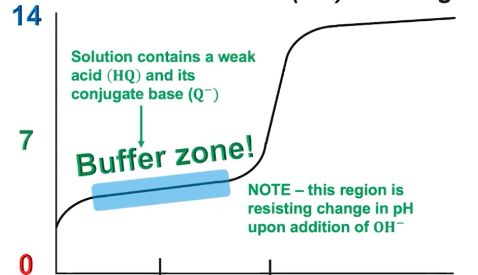{width="5.53125in" height="3.1770833333333335in"}

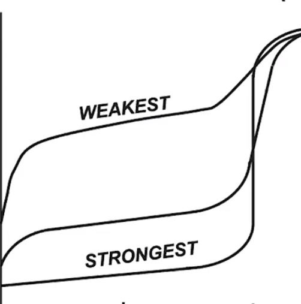{width="3.4791666666666665in" height="3.5104166666666665in"}
-   For weak acids: less hydroxide buffer because less disassociation
-   For stronger acids: more hydroxide buffer because more disassociation

```{=html}
<!-- -->
```
-   **ASSUMING THE SAME STARTING MOLARITY:** As strength of acid decreases,

    -   Starting pH will increase

        -   Stronger acids will disassociate more, decreasing the initial pH

    -   Larger jump to buffer zone

    -   Higher pH at equivalence point

        -   The weaker the acid, the stronger its conjugate base (raises pH)

**Titration curve for strong acid and weak base:**
-   pH starts high because initially, the base is the only species present
-   At Equivalence point:

    -   Weak base is fully titrated

    -   Conjugate acid will be present ([HY+])

    -   Conjugate acid will react with water and cause the solution to be acidic

        -   pH is because of the reaction of the conjugate acid with water

        -   Not because the acid is strong
-   At half equivalence point:

    -   {width="6.354166666666667in" height="0.3541666666666667in"}

        -   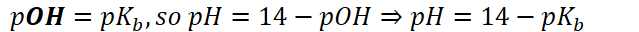{width="6.65625in" height="0.3333333333333333in"}

    -   Before half equivalence point: weak base [Y] is dominant

    -   After half equivalence point: conjugate acid [HY^+^] is dominant
-   At end: pH is dictated by excess H^+^, the excess strong acid

    -   Because [HY^+^] is weak acid, the H^+^ contribution at the end is negligible

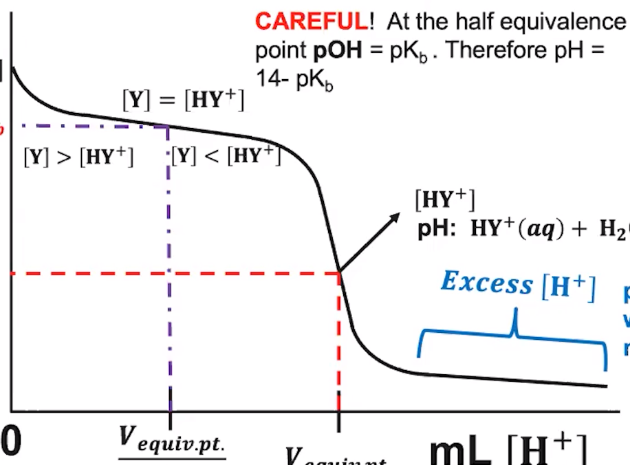{width="6.354166666666667in" height="4.6875in"}
-   Buffer zone present at beginning due to presence of weak base **and** some conjugate acid

    -   Resists change in pH on addition of H^+^
-   Stronger base: (assuming same starting molarity)

    -   Starting pH is higher

        -   Base disassociates more, increasing pH

    -   Higher equivalence point: the stronger a base, the weaker its conjugate acid

        -   Will not bring down the pH as much

    -   Smaller drop to buffer zone
-   Example:

{width="8.572916666666666in" height="3.0104166666666665in"}

Vey" Mess: . to

Molarities some

30 "L: Into = 0.0} AL

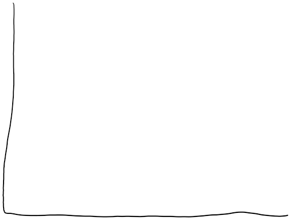{width="5.927083333333333in" height="4.46875in"}

. f

{width="0.6145833333333334in" height="0.13541666666666666in"}{width="0.4583333333333333in" height="2.1145833333333335in"}

9. " .

Easy

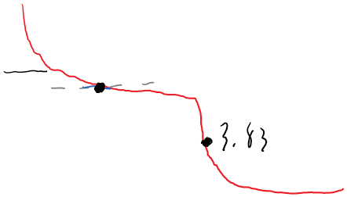{width="4.604166666666667in" height="2.625in"}

. 4-1.67=6.70

.

trey

{width="0.1875in" height="2.3125in"}

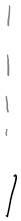{width="0.21875in" height="2.3020833333333335in"}

f f molarity not

-- - -- E size, assure

~ L

{width="1.1666666666666667in" height="0.13541666666666666in"}


I

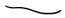{width="0.6770833333333334in" height="0.1875in"}


I. Pish 0.03 IL
-   


