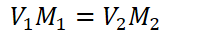
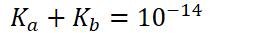
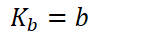
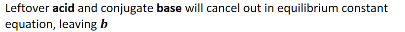
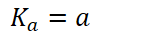
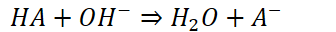
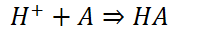

# Acid-base Reactions and Buffers
-   Acid-base neutralization

    -   Acid + base => salt + water

    -   Usually results in some remaining hydronium/hydroxide

        -   pH does not always return to 7 (neutral)!
-   Steps to approach acid-base reactions:

    -   Dilution: account for adding volume to volume

        -   {width="2.2395833333333335in" height="0.3333333333333333in"}

    -   Stoichiometry: Any strong acid and base will proceed with forward reaction (making product) until the limiting reactant runs out

        -   Molarity can be used in stoichiometry as long as all dilutions are accounted for **(volume the same = moles are dependent entirely on molarity)**

    -   Equilibrium: If weak acids/bases are involved, equilibrium calculations are necessary

    -   For any acid and its conjugate base/weak base/conjugate acid

        -   {width="2.6770833333333335in" height="0.34375in"}
-   **Strong acid and strong base: usually DILUTION and STOICHIOMETRY**

    -   Determine molarities with diluted volume

    -   Perform stoichiometry with molarities, assuming reaction goes to completion

    -   Find pH based on leftover hydronium or hydroxide
-   **Weak acid and strong base: DILUTION, STOICHIOMETRY, and EQUILIBRIUM**

    -   Conjugate base will be created

    -   Need to perform equilibrium with conjugate base

        -   Results from stoichiometry will be brought into initial conditions of equilibrium

        -   Equilibrium is partial disassociation of acid in water
-   **Strong acid and weak base: DILUTION, STOICHIOMETRY, EQUILIBRIUM**

    -   Creates conjugate acid

    -   Equilibrium needs to be done on resultant conjugate acid (and leftover base/acid if present)

        -   Same rules as weak acid + strong base
-   Equal amount of acid and strong base is **equivalence point**

    -   When [acid]=[base] (co-limiting reactants)

    -   pH is dictated by reaction of **conjugate base** (or conjugate acid if the reaction is weak base + strong acid)
-   When **exactly half** of the acid has been neutralized, this is called the **half equivalence point**

    -   For weak **base**/strong acid:

        -   {width="1.4791666666666667in" height="0.3333333333333333in"}

            -   {width="8.5625in" height="0.6875in"}

    -   For weak **acid**/strong base:

        -   {width="1.4895833333333333in" height="0.3333333333333333in"}

            -   {width="7.239583333333333in" height="0.3541666666666667in"}

**Buffer solution**
-   Weak acid + conjugate base OR weak base + conjugate acid
-   Will resist changes in pH upon small amounts of acid or base
-   Weak acid (or conjugate weak acid) will react with added base

    -   {width="3.5in" height="0.3333333333333333in"}
-   Weak base (or conjugate weak base) will react with added acid

    -   {width="2.3125in" height="0.3333333333333333in"}
-   Four ways to make a buffer solution:

    -   Partial neutralization of a weak acid with a strong base

    -   Partial neutralization of a weak base with a strong acid

    -   {width="6.802083333333333in" height="0.3541666666666667in"}

    -   {width="7.40625in" height="0.3541666666666667in"}
-   

