# Introduction to acids and bases
-   Autoionization of water:
-   When pure water is present, there is still an equilibrium:

    -   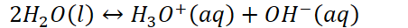{width="4.708333333333333in" height="0.3333333333333333in"}

        -   One molecule of water (the acid in this case) donates a proton to another molecule of water (the base)

            -   {width="3.03125in" height="0.3541666666666667in"}

            -   {width="3.1979166666666665in" height="0.3541666666666667in"}

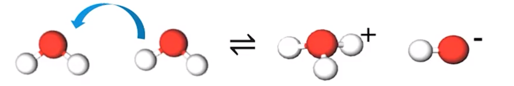{width="6.197916666666667in" height="1.0416666666666667in"}
-   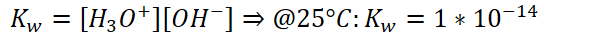{width="6.177083333333333in" height="0.34375in"}

```{=html}
<!-- -->
```
-   Temperature dependence:

    -   {width="4.927083333333333in" height="0.3541666666666667in"}

    -   {width="8.916666666666666in" height="0.3541666666666667in"}

        -   Because temperature favors the endothermic direction, and more product is formed when temperature rises,

            -   The autoionization of water is endothermic in the forward direction

            -   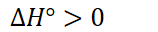{width="1.6458333333333333in" height="0.3333333333333333in"}

        -   **The neutral pH changes according to temperature**

            -   {width="8.072916666666666in" height="0.3541666666666667in"}

```{=html}
<!-- -->
```
-   pH scale: a simplified way that communicates whether a solution is acidic, basic, or neutral

    -   Based on concentrations of hydronium and hydroxide

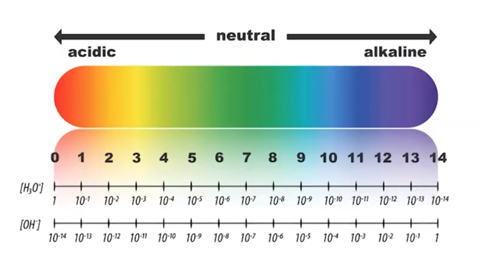{width="5.979166666666667in" height="3.1875in"}
-   Acidic: lots of hydronium (potential proton donors)

    -   pH < 7
-   Basic: lots of hydroxide (potential proton acceptors)

    -   Bases do not disassociate: they **protonate (accept a proton)**

    -   pH > 7
-   {width="3.78125in" height="0.3541666666666667in"}
-   {width="3.96875in" height="0.3541666666666667in"}
-   {width="3.7083333333333335in" height="0.3541666666666667in"}
-   Simplifies a large range of values into values 1-14

    -   From [1] to [10^-14^] => 1 to 14
-   {width="9.791666666666666in" height="0.3541666666666667in"}

    -   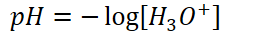{width="2.8645833333333335in" height="0.3333333333333333in"}

    -   {width="5.614583333333333in" height="0.3541666666666667in"}

    -   {width="6.083333333333333in" height="0.3541666666666667in"}

    -   **Anything relating to acid/base with p in front has been taken the -log of!**

        -   {width="4.083333333333333in" height="0.3541666666666667in"}

```{=html}
<!-- -->
```
-   Therefore,

    -   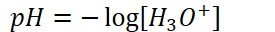{width="2.8645833333333335in" height="0.3333333333333333in"}

    -   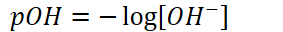{width="2.9479166666666665in" height="0.3333333333333333in"}

    -   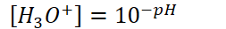{width="2.6354166666666665in" height="0.34375in"}

    -   {width="2.5208333333333335in" height="0.34375in"}

    -   {width="3.3854166666666665in" height="0.3541666666666667in"}

    -   {width="3.2708333333333335in" height="0.3541666666666667in"}

        -   {width="3.75in" height="0.34375in"}

        -   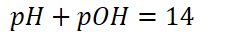{width="2.5729166666666665in" height="0.3333333333333333in"}
-   Remember: [] means molarity--give appropriate units

    -   pH / pOH do not have units

**Estimating pH**
-   pH = 8.693

    -   Whole number: magnitude (power)

    -   Decimal: measurement
-   {width="4.072916666666667in" height="0.3541666666666667in"}

    -   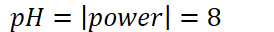{width="2.8541666666666665in" height="0.3333333333333333in"}
-   If coefficient is greater than 1 and less than 10:

    -   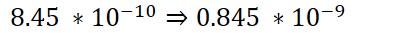{width="4.15625in" height="0.34375in"}

        -   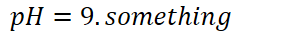{width="2.96875in" height="0.3333333333333333in"}

        -   Close enough


