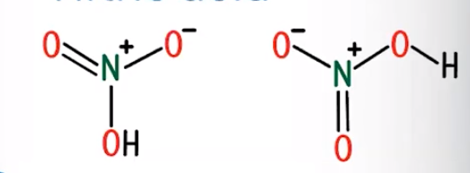
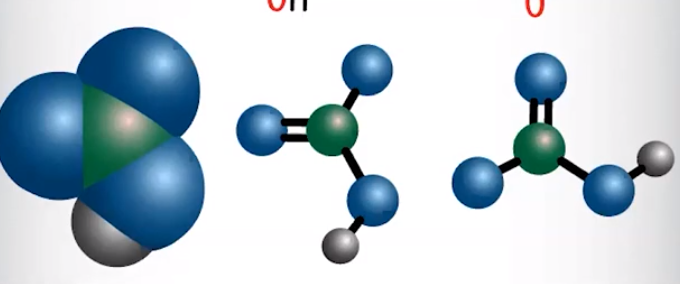
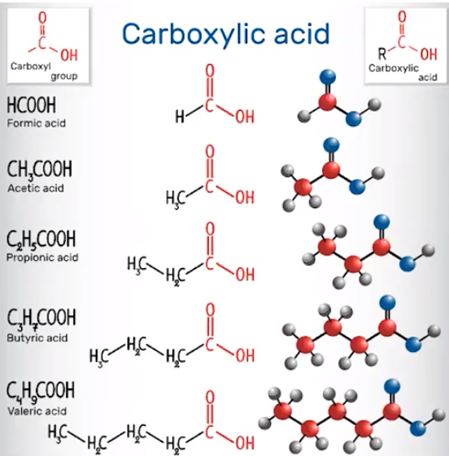

# Molecular Structure of Acids and Bases

    -   Stronger acids have weak H-X bonds

        -   Have more stable conjugates (less likely to disassociate)

        -   HCl - bond between H and Cl is weak

    -   Weaker acids have strong H-X bonds

        -   Have less stable conjugates

        -   HF - bond between H and F is strong

    ```{=html}
    <!-- -->
    ```
    -   Why?

        -   Weaker bonds => more disassociation

            -   H^+^ is pulled away more easily

```{=html}
<!-- -->
```
-   **Oxoacids/oxyacids:** an atom bonded with one or more oxygen atoms, sometimes with hydrogen atoms attached
-   **Inductive Effect**: the attraction of electrons in adjacent bonds by more electronegative atoms

    -   Strong acids can experience an inductive effect

        -   Due to highly electronegative oxygen atoms

        -   {width="3.8020833333333335in" height="0.3541666666666667in"}

{width="3.625in" height="1.3333333333333333in"}


{width="4.71875in" height="1.96875in"}
-   Hydrogen is pulled away from OH

    -   In this case, creates resonance structures as H^+^ is being pulled between nitrogen atoms

    -   **More electronegative atoms => electrons will be pulled away from hydrogen, making it more likely to disassociate**

```{=html}
<!-- -->
```
-   {width="10.010416666666666in" height="0.6875in"}

    -   **Even charge => more stable (weaker)**

    -   Electronegative elements stabilize a conjugate base relative to its conjugate acid

        -   Able to handle negative charge better

```{=html}
<!-- -->
```
-   Weak acids, like carboxylic (COOH) acids, do not experience a strong induced dipole force

    -   **Less polarity => hydrogen ion more attracted to oxygen => less ionizable (harder to take away H^+^)**

    -   **Conjugate bases are less stable, which results in them being stronger**

    -   Example: Acetate is a stronger conjugate base, which is less stable than acetic acid

{width="3.8229166666666665in" height="3.8854166666666665in"}
-   **Bases**

    -   Stronger bases tend to attract protons

        -   Two factors that influence a strength of a base:

            -   How easily a lone pair picks up a hydrogen ion

            -   The stability of the ions being formed

        -   The conjugate bases of:

            -   Carboxylic acids

            -   Anions of other weak acids

            -   Hydrated metal cations

        -   All act as bases

            -   Organic amines (ammonia compounds) also act as bases

        -   Remember: larger K~b~ indicates a better proton acceptor

    -   More negative charge => attracts protons


