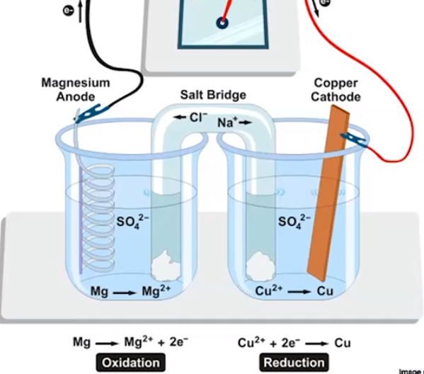
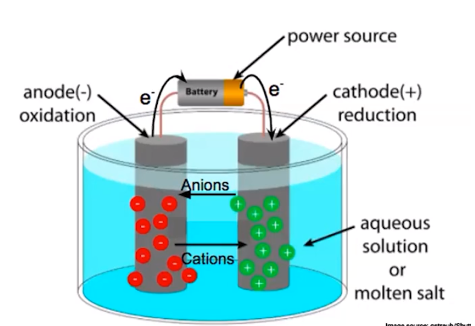

# Galvanic/Electrolytic Cells
-   An electrochemical cell is a device that can:

    -   Convert energy from a (thermodynamically favorable) redox reaction to electrical energy, or

    -   Can use electrical energy to drive a thermodynamically unfavorable redox reaction

        -   **Galvanic cells:** involve a thermodynamically favorable reaction

            -   Produces electrical energy (positive voltage value)

        -   **Electrolytic cells:** involve a thermodynamically unfavorable reaction

            -   Uses electrical energy (negative voltage value)
-   Both types of cells contain:

    -   Anode: where oxidation occurs

    -   Cathode: where reduction occurs


-   **Voltaic (galvanic) Cell:**

{width="4.15625in" height="3.6666666666666665in"}


-   Magnesium is being oxidized
-   Copper is being reduced
-   {width="5.583333333333333in" height="0.34375in"}

    -   {width="3.0729166666666665in" height="0.3541666666666667in"}

    -   {width="2.9375in" height="0.3541666666666667in"}

    ```{=html}
    <!-- -->
    ```
    -   Electrons are being produced in the anode

        -   {width="3.8541666666666665in" height="0.34375in"}

    -   Electrons travel through the wire into the cathode

    -   Electrons are then consumed in the cathode

        -   {width="3.6979166666666665in" height="0.34375in"}

```{=html}
<!-- -->
```
-   **Anode:**

    -   Where the oxidation occurs

    -   Anode can be a reactant (ex. a metal) which is oxidized, or an inert solid (platinum, graphite) if the reactants are liquid or gas-phase

    -   If the anode is **metal**, the **mass decreases** as the metal is ionized

        -   Some solid metal turns into aqueous ions

    -   Sits in an ionic solution
-   **Electrons flow from anode to cathode through wire**
-   **Cathode**

    -   Cathode is where reduction occurs

    -   Can be a product (metal) or an inert solid if the products are liquid/gas phase

    -   If the product is a solid that gets deposited on the cathode, **mass** of the cathode **increases**

    -   Cathode sits in an ionic solution **to allow for the movement of charged particles**

        -   In a circuit, charged particles need to be able to move freely

    -   Electrons flow **into** the cathode
-   **Salt Bridge**

    -   Allows for the movement of ions between half cells

    -   Needs to contain **inert ionic solution**

        -   {width="2.5729166666666665in" height="0.3333333333333333in"}

    -   Salt cations move into the reduction half-cell

    -   Salt anions move into the oxidation half-cell

        -   They then react with the Mg and Cu

    -   Necessary for completing the circuit

```{=html}
<!-- -->
```
-   Electrolytic cell components

    -   Involve a **thermodynamically unfavorable** reaction

    -   {width="5.458333333333333in" height="3.75in"}

    -   A power source is needed

        -   **Negative** voltage value

    -   Reaction occurs in a single chamber (no salt bridge)

    -   Electrons flow from anode -> power source -> cathode

    -   Occurs in an ionic solution/liquid

        -   Cations flow to the cathode and anions flow to the cathode to maintain balance of charge


