# Gibbs Free Energy + Thermodynamic Favorability
-   Chemical reactions proceed until **equilibrium is reached**

    -   Some favor reactants and some favor the products
-   {width="11.072916666666666in" height="0.6875in"}

    -   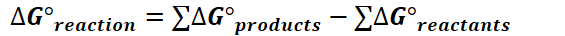{width="5.885416666666667in" height="0.375in"}
-   Gibbs free energy change

    -   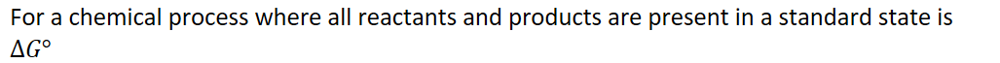{width="10.697916666666666in" height="0.6770833333333334in"}

        -   Standard state: pure substances, 1.0*M* solutions, gases at 1 atm

    -   {width="8.395833333333334in" height="0.3541666666666667in"}

        -   {width="8.708333333333334in" height="0.3541666666666667in"}

    -   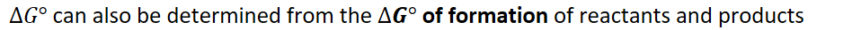{width="9.875in" height="0.3541666666666667in"}

    -   {width="5.885416666666667in" height="0.375in"}

        -   Remember to **account for coefficients** in balanced chemical equations
-   {width="5.84375in" height="0.3541666666666667in"}
-   **ENTROPY** and **GIBBS FREE ENERGY** are **NOT THE SAME!**
-   Thermodynamic Favorability:

    -   **Thermodynamically favorable** changes **proceed to equilibrium** without external intervention

        -   However, just because a reaction is favorable doesn't mean it happens **quickly**

        -   RATE is **not** a THERMODYNAMIC property

    -   It is sometimes necessary to consider **both** entropy and enthalpy to determine thermodynamic favorability

        -   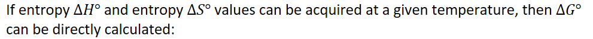{width="10.322916666666666in" height="0.6875in"}

            -   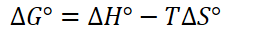{width="2.8541666666666665in" height="0.3333333333333333in"}

                -   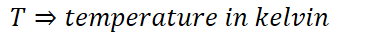{width="3.9791666666666665in" height="0.3333333333333333in"}

                -   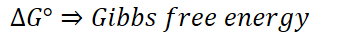{width="3.78125in" height="0.3333333333333333in"}

                -   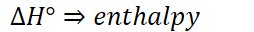{width="2.6458333333333335in" height="0.3333333333333333in"}

                -   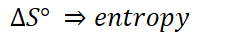{width="2.53125in" height="0.3333333333333333in"}

        -   {width="9.84375in" height="0.3541666666666667in"}

| 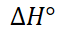{width="0.7083333333333334in" height="0.3333333333333333in"} | 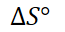{width="0.6770833333333334in" height="0.3333333333333333in"} | Symbols | 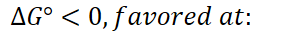{width="3.1770833333333335in" height="0.3333333333333333in"} |                                                                                                                                                        |
|----------------------------------------------------------------------------------------------------------------------------------------------------------|----------------------------------------------------------------------------------------------------------------------------------------------------------|---------|----------------------------------------------------------------------------------------------------------------------------------------------------------|---------------------------------------------------------------------------------------------------------------------------------------------------------|
| < 0                                                                                                                                                     | > 0                                                                                                                                                     | < >   | {width="2.25in" height="0.3541666666666667in"}               | Value is always negative                                                                                                                                |
| > 0                                                                                                                                                     | < 0                                                                                                                                                     | > <   | {width="3.1666666666666665in" height="0.3541666666666667in"} | Value is always positive                                                                                                                                |
| > 0                                                                                                                                                     | > 0                                                                                                                                                     | > >   | 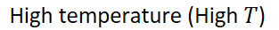{width="3.2604166666666665in" height="0.3541666666666667in"} | 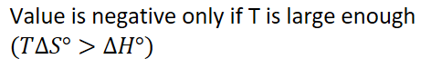{width="4.916666666666667in" height="0.6770833333333334in"} |
| < 0                                                                                                                                                     | < 0                                                                                                                                                     | < <   | Low temperature (Low T)                                                                                                                                  | 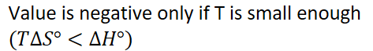{width="4.927083333333333in" height="0.6770833333333334in"} |
-   {width="7.666666666666667in" height="0.3541666666666667in"}

    -   Reaction is thermodynamically favorable

```{=html}
<!-- -->
```
-   {width="7.958333333333333in" height="0.3541666666666667in"}

    -   Reaction is thermodynamically unfavorable


