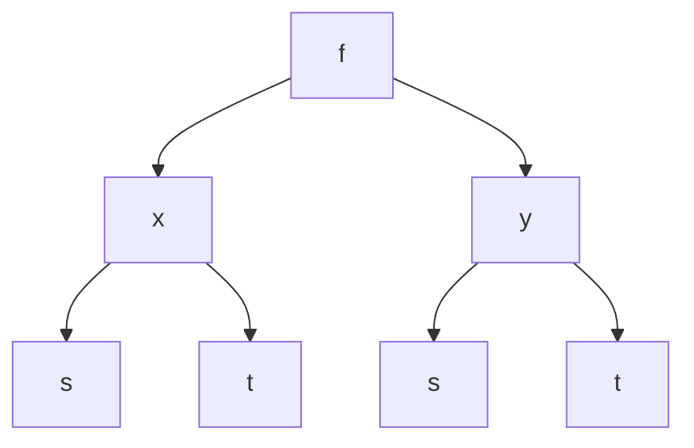
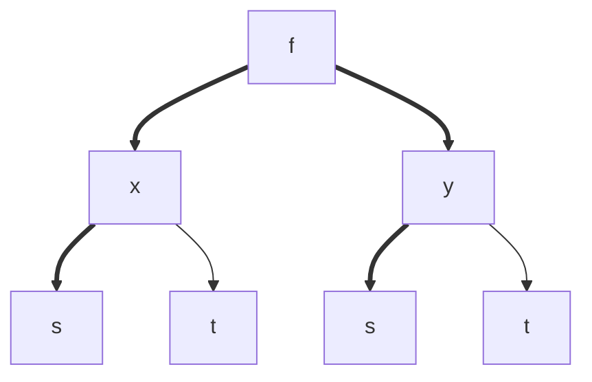
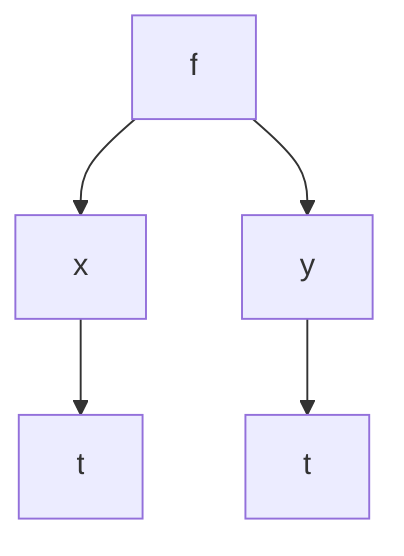
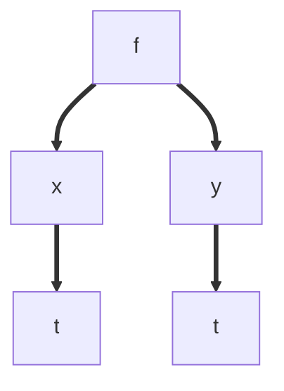

Sometimes we need to apply the [[Chain Rule]] for functions of three dimensions, given:

$$
f(x, y)
$$

Where:

$$
x(s, t) \ and \ y(s, t)
$$

We may need to find derivatives spanning two "levels," like for example:

$$
\frac{\partial F}{\partial s} \ or \ 
\frac{\partial F}{\partial t}
$$

A dependency graph can be used to detail which variables are functions of which others:

This can be used to determine what we need to compute the division

For example, to compute $\frac{\partial f}{\partial s}$:

Find all paths that lead from $f$ to $s$:

So the application of the chain rule is:

$$
\frac{\partial f}{\partial s} = 
\frac{\partial f}{\partial x} 
\frac{\partial x}{\partial s} 
+
\frac{\partial f}{\partial y} 
\frac{\partial y}{\partial s} 
$$

Not everything needs to be a partial derivative - for example, given the functions:

$$
f(x, y), \ x(t), \  y(t)
$$

Then our dependency graph looks like:

And to find $\frac{\partial f}{\partial t}$:

So

$$
\frac{\partial f}{\partial s} = 
\frac{\partial f}{\partial x} 
\frac{dx}{dt} 
+
\frac{\partial f}{\partial y} 
\frac{dy}{dt} 
$$
