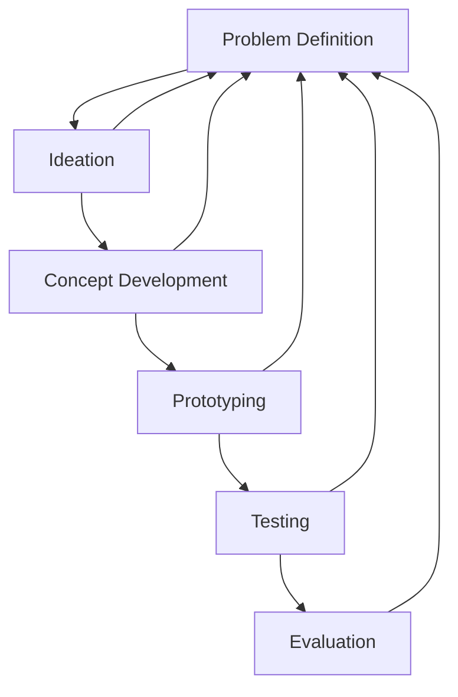

**Design** - the process of developing a satisfactory idea to solve a specific problem

> Developing - evaluating, iterating, refining
> idea- thinking, creativity, imagination
> specific - design requirements

Design is **not** trial and error

Changes should come either **iteratively** or **early**

