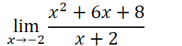
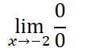
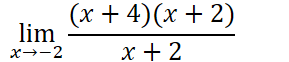
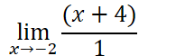
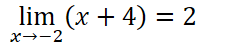
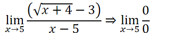
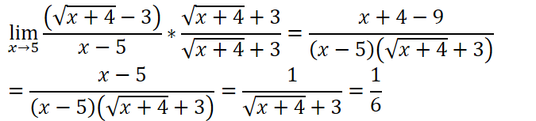

What happens when direct substitution gives us an undefined answer?
Try evaluating both the numerator and the denominator

> If they both evaluate to $\frac{0}{0}$, this is called the **indeterminate form**

Removable discontinuities “holes”

Example:

We can then use one or more rules to try to get out of the indeterminate form:

**Factoring**

Try to factor/cancel out the denominator

  

Factoring and cancelling is not limited to quadratics

> Factor out constants, single variables, etc. to try to cancel the offending term of the denominator

**There is no guarantee that factoring an indeterminate form function will give you a limit**

> Can still lead to division by zero in a non-indeterminate form

**Conjugates**

You can also try to cancel out the offending term of the denominator using conjugates when a radical is involved

Multiply by the conjugate of the radical over itself (effectively multiplying by 1, which is legal)

**Using known limits**

Rewrite the limit in a way that the known (given) limit and the limit we are trying to find are distinct

**Graphing**

Sometimes, it is just the most effective to graph the function

> Especially absolute value functions where there is no other mathematical equivalent

Determine the limit visually
