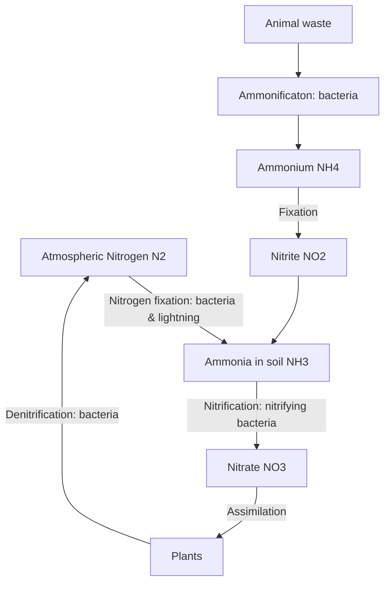

Nitrogen has a gas phase, so the nitrogen cycle happens quickly

NItrogen gas is absorbed into soil, fixed by plants, ammonified, nitrified, assimilation

$$N_2 \rightarrow NH_3 \rightarrow NH_4 \rightarrow NO_2^- \rightarrow NO_3^- \rightarrow Plants \rightarrow N^2$$

$N_2$ needs to be fixed by plants, because nitrogen is not very reactive - triple covalent bond!

Nitrate is very readily absorbed into plants, and facilitates plant growth

![[Pasted image 20221010221903.png]]