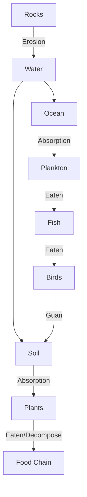

Phosphorous has no gas phase, insoluble in water - slow process!

Depends on geologic cycle (movement of rocks)

Integral in plant growth - usually a limiting factor, also key ingredient in fertilizers

**Phosphate**: most common form, can form minerals. Essential for ATP production, nucleotides, bones, teeth, shells, etc.

Phosphorous enters biotic systems through uptake by plants, algae, bacteria

Eroded, enters soil, absorbed by plants/bacteria

> Plants only absorb phosphorous when phosphate is dissolved in water

Can also be upwelled from oceans: absorbed by plankton, plankton eaten by fish, fish eaten by birds and excrement deposited onto soil

