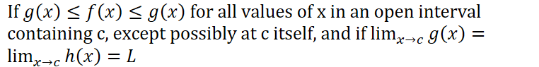
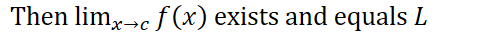
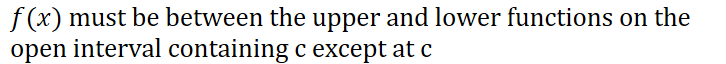
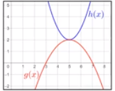
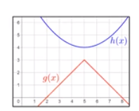

The function will be "squeezed" between the lower and upper function as they are both approaching the same values

**Conditions**

The upper and lower functions must approach **exactly** the same value at c

Example:

Two parabolas

The squeeze theorem does **not** apply to this:

Because at $x = 5$, the two functions do not approach the same value
