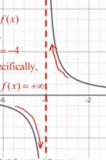
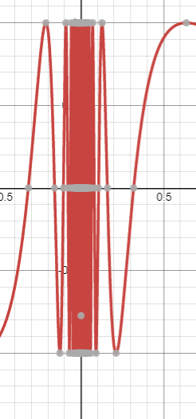

**Vertical Asymptote:**

- The limit does not exist
- Limits of sides are either infinity or -infinity
- Limit at x value does not exist
- f(x) is undefined
- The vertical asymptote is at x

Usually occurs when the denominator approaches zero, gets smaller and smaller

**Jump Discontinuity:**

- Limit does not exist
- The y-value "jumps" at an immediate x value change
- Usually happens with piecewise functions
- Right and left limits may exist, but will not agree

**Removable Discontinuity ("hole"):**

- Limit does exist
- Function is not defined at that point

Usually evaluates to indeterminate form $\frac{0}{0}$

Oscillating Discontinuity

Left/right and double-sided limits do not exist

"bounces" between two values, usually indefinitely

Most common example:
$$y = \sin{\frac{1}{x}}$$

When given a table of points, **never** fill in the gaps between the points unless you are given additional information

